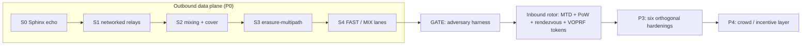

# Changelog

All notable changes to **Gyre** are documented here.

The format is based on [Keep a Changelog](https://keepachangelog.com/en/1.1.0/),
and this project aims to adhere to [Semantic Versioning](https://semver.org/spec/v2.0.0.html).

> [!NOTE]
> This is a **pre-1.0 research build**. No version has been **tagged or released**,
> and nothing is **published to crates.io**. Under SemVer, `0.y.z` is initial
> development: anything may change at any time, and the public API is not stable.
> The current workspace version is `0.0.1`.

> [!WARNING]
> Gyre is **early-stage and UNAUDITED**. Do **not** rely on it for real
> anonymity or safety yet. Every claim here is *measured before it is trusted*,
> and the honest ceilings live inline with the entries that earn them — not at the
> bottom. See [`docs/DESIGN.md`](docs/DESIGN.md) for the full threat model.

---

## Contents

- [Unreleased](#unreleased)
  - [Milestone status](#milestone-status)
  - [Added](#added)
  - [Changed](#changed)
  - [Fixed](#fixed)
  - [Deferred](#deferred-not-a-keep-a-changelog-category)
- [About versioning](#about-versioning)

---

## [Unreleased]

Gyre has been built **milestone by milestone**, entirely in the open. The
build history below is the real thing — a layered privacy-and-defense fabric with
**two rotors**: an *outbound* mixer that dissolves a person into a crowd, and an
*inbound* shield that hides and protects a system.

### Milestone status

- [x] **P0** outbound data plane (S0 → S4)
- [x] **GATE** partial-observer correlation harness (go/no-go)
- [x] **Inbound rotor** — MTD, PoW admission, rendezvous, VOPRF tokens
- [x] **P3** hardening — all six orthogonal additions
- [x] **P4** crowd / incentive layer
- [x] **S5** QUIC transport (consensus-pinned relay certificates); MASQUE not implemented

### Added

Entries are listed in the order they were built. Each capability claim carries its
honest ceiling inline, wherever one applies.

**P0 — Outbound data plane (protect a person)**

- **S0 — Sphinx onion echo.** `gyre-sphinx`, a typed wrapper over the audited
  `sphinx-packet` mix-packet format, with end-to-end onion encrypt/echo. Shared
  constants and types land in `gyre-common` (`FlowClass`, `DEFAULT_HOPS = 3`).
- **S1 — Networked relays.** `gyre-net` async transport, directory, and relay
  server carry the Sphinx onion over the wire (TCP length-prefixed frames). No
  single relay learns both ends; the onion is capped at 3 hops (D5).
- **S2 — Mixing + cover.** Per-hop Poisson mixing and Loopix shared cover traffic
  in `gyre-net`.
  *Ceiling:* Loopix global-observer resistance holds **only at mix latency**,
  never at low latency.
- **S3 — Erasure-coded multipath.** `gyre-fec` Reed–Solomon fragmentation and
  reassembly across paths.
  *Ceiling (D7):* this is **probabilistic middle-path hardening** against a
  *partial* observer — **not** a reconstruction threshold. Endpoints stay exposed,
  and spreading a message over more paths *widens* what a partial observer touches
  (measured under the GATE). It buys availability and content-splitting, not
  correlation resistance.
- **S4 — FAST / MIX adaptive lanes.** Per-flow choice between a low-latency **FAST**
  lane and a mixing **MIX** lane, sealed inside the onion (D8). The `gyre-node`
  demo spins up a testnet and times both lanes on the same route.

**The GATE (the go/no-go)**

- **GATE — adversary-emulation harness.** `gyre-adversary`, a partial-observer
  timing-correlation harness that emits a verdict. It is the instrument every
  later claim is checked against.
  

  
Measured verdict (quoted from the harness)

  | flows | window | mix/hop | accuracy | chance | note |
  |------:|-------:|--------:|---------:|-------:|------|
  | 50 | 1000ms | 0ms | 1.00 | 0.02 | baseline: no mixing (FAST lane) |
  | 50 | 1000ms | 50ms | 0.11 | 0.02 | MIX lane, healthy crowd |
  | 50 | 1000ms | 150ms | 0.04 | 0.02 | more mixing |
  | 5 | 1000ms | 150ms | 0.44 | 0.20 | same mixing, tiny crowd → barely helps |

  Multipath exposure — fraction of flows a partial observer on 20% of paths
  touches: single-path (k=1) `0.23`, multipath (k=3) `0.56`.

  **Verdict:** (1) mixing works and is the real correlation-resistance lever
  (`1.00` → near chance); (2) it is **gated on the crowd** (tiny crowd `0.44` —
  cleverness never manufactures anonymity); (3) multipath does **not** buy
  partial-observer correlation resistance — it *widens* exposure (`0.23` → `0.56`).
  

**Inbound rotor (protect a system)**

- **MTD ingress hopping + PoW admission.** `gyre-shield` moving-target-defense
  address hopping via `HMAC(key, time_window)`, plus proof-of-work admission.
  *Ceiling (D2):* rotation is **defense, not anonymity**.
- **Rendezvous origin-hiding.** Rendezvous-based origin hiding for the protected
  asset, so the origin never faces clients directly.
- **VOPRF capability tokens.** Unlinkable capability tokens (blind *verifiable* OPRF,
  RFC 9497 *shape*) complete the inbound rotor. The issuer attaches a **DLEQ proof** that
  it used its published key; the client refuses the token otherwise.
  *Ceiling:* this is a **hand-built PROTOTYPE** on `curve25519-dalek` primitives
  and is **UNAUDITED** — the prepared audit package is [`docs/AUDIT.md`](docs/AUDIT.md).
  Anonymous credentials add **zero** intrinsic Sybil resistance — only the scarce
  resource (PoW / stake) does.

**P3 — Six orthogonal hardening additions** (added *by threat*, not by default;
a matrix, not a stack — D10). Shipped in landing order 1, 2, 4, 6, 5; Addition 3
(anonymous credentials) had already shipped as the VOPRF token above.

- **Addition 1 — Obfuscation / pluggable transports.** `gyre-obfs`: a
  pluggable-transport framework, transports, and an entropy meter.
  *Ceiling:* appearance only, **zero anonymity effect**. "Unblockable" is not
  claimed — obfuscation only makes blocking *more expensive than a censor will pay
  today*, and random-byte transports are themselves a positive entropy-DPI
  fingerprint.
- **Addition 2 — Endpoint hardening + data minimization.** `gyre-endpoint`:
  forward-secret ratchet, personas, uniform fingerprint.
  *Ceiling:* endpoint compromise (a login, a device, a fingerprint) deanonymises
  regardless of the network.
- **Addition 4 — Decentralization + attestation.** `gyre-directory`:
  threshold-signed consensus, equivocation detection, build attestation.
  *Ceiling:* **detection, not prevention** — reproducible builds prove
  *binary == source*, not that a relay actually runs that binary.
- **Addition 6 — Private directory retrieval.** `gyre-pir`: 2-server IT-PIR.
  *Ceiling:* **default OFF** — a full signed directory download is leak-free and
  cheaper; PIR is surgical, not the default path (D18).
- **Addition 5 — Deniability / steganography.** `gyre-stego`: LSB steganography.
  *Ceiling:* **situational** — LSB stego is trivially detectable.

**P4 — Crowd / incentive layer**

- **Crowd admission + Sybil pricing.** `gyre-crowd`: a k-anonymity admission
  governor and a staking Sybil-pricing model.
  *Ceiling:* the crowd is the binding constraint everywhere (D12, D20). Staking is
  **wealth concentration, not user-decentralization**, and adds no intrinsic Sybil
  resistance on its own.

**Tooling & quality gates**

- **Workspace.** 15 crates, 171 tests, all green. See [`README.md`](README.md) and
  [`docs/DESIGN.md`](docs/DESIGN.md).
- **Gates.** `cargo fmt --all -- --check`, `cargo clippy --workspace
  --all-targets -- -D warnings`, and `cargo test --workspace`. CI runs all three
  on every pull request and on pushes to `main`.
- **Standalone binaries — `gyre-relay`, `gyre-client`, `gyre-sink` (`gyre-cli`).** Until
  now everything ran inside one process, which meant neither a network simulator nor a real
  deployment was possible. These are real processes that bind real sockets and take their
  peers from argv. `./scripts/testnet.sh` launches a three-relay testnet and pushes onions
  through it; mixing visibly **reorders packets between separate OS processes** (sent
  0,1,2 → delivered 1,2,0), with each relay logging only its own neighbour.
  *Testnet keys are derived from public labels and are therefore **not secret** — that is
  fine for simulation and nowhere else; a deployment must use OS randomness and publish
  only public halves through the signed consensus.*
- **`Relay::from_secret_bytes`.** A relay that regenerated its key on restart would
  invalidate every descriptor already published about it and every onion in flight for it.
  Same gap as the token issuer had.
- **Free Linux CI.** `.github/workflows/testnet.yml` runs the multi-process testnet on
  every push (GitHub-hosted runners are free and unlimited for public repositories), and
  `.github/workflows/shadow.yml` builds Shadow and runs the simulation on demand — so
  Shadow results no longer require owning a Linux machine. The Shadow workflow has **not
  been run yet**; `sim/shadow/` says so rather than implying otherwise.
- **S5 — QUIC transport with consensus-pinned relay certificates.** `gyre-net::quic` gives
  each circuit its own QUIC stream, so a lost packet on one no longer stalls the others
  (cross-circuit head-of-line blocking). Relays have no CA-issued certificates, and the two
  usual shortcuts are both unacceptable — disabling verification authenticates nothing, and
  trust-on-first-use hands the relay to whoever is present first. Instead each relay
  self-signs and publishes its **SHA-256 certificate fingerprint** in the threshold-signed
  consensus; the client pins it and refuses anything else, while TLS 1.3 signature
  verification is **delegated to `rustls`** so the peer must also prove it holds the key.
  *Ceiling:* this is a **performance and authentication** change with **zero** effect on
  anonymity — the onion, the mixing and the crowd provide that, not the byte transport.
  Verified by tests that assert an impostor relay is refused *and that it is refused for
  the right reason*.
- **Q4 — consensus-pinned issuer key (completes the token fix).** The DLEQ proof is only
  worth anything if the key it is checked against did not come from the issuer, so the
  consensus body is now a **typed, canonically encoded** `NetworkParams` document
  (`gyre-directory::params`) carrying the issuer public key, PoW difficulty, MTD window and
  relay set. Decoding is strict — exact length, known magic and version, **no trailing
  bytes** — so each document has exactly one valid encoding; a lenient parser would let a
  signature over one byte string appear to cover another. `VerifiedParams` can be produced
  **only** by `verify_consensus` (non-zero threshold, enough distinct valid signatures,
  well-formed body, and the body's epoch bound to the envelope), and
  `token::PublicKey::from_verified_params` is the blessed way to obtain a key. The
  unverified path survives for tests but is named `from_unverified_bytes` so a grep finds
  every place trust was assumed. End-to-end coverage in
  `crates/gyre-shield/tests/consensus_pinned_key.rs`, including the full attack: a rogue
  issuer with an internally valid proof for *its own* key is refused.
- **Cryptographic audit package** ([`docs/AUDIT.md`](docs/AUDIT.md)) for the one hand-built
  construction: full specification, security model with the four claimed properties,
  a table of every deviation from RFC 9497, seven self-review findings (one critical, see
  *Fixed*), six ranked open questions for an auditor, and reproducible test vectors
  (`cargo test -p gyre-shield --test token_vectors`). Also adds
  `Issuer::from_secret_seed` so an operator can reload a key across restarts — without it,
  every restart silently invalidated outstanding tokens.
- **Simulation harness (`gyre-sim`) — the GATE, run against the real code.** A
  discrete-event simulator that drives the **actual** protocol implementation (real Sphinx
  onions, real X25519 relay keys, the real Loopix delay sampler, real packet sizes) over a
  modelled network, and attacks it with the **strongest matcher we can construct**:
  a maximum-likelihood (Erlang) cost solved **optimally** by the Hungarian algorithm
  (verified against brute force for `n ≤ 6`). Flows are multi-packet circuits, because
  single-message flows understate stream correlation. Reports coverage, accuracy, the
  end-to-end **deanonymisation rate** (`coverage × accuracy`), latency percentiles, and
  wire overhead. Run with `cargo run --release -p gyre-sim`; full write-up in
  [`docs/SIMULATION.md`](docs/SIMULATION.md).
- **Shadow scaffolding** (`sim/shadow/`) for the Linux-only next step — explicitly marked
  **not yet executed**, since Shadow cannot run on the machine used here.
- **Property-based test suite (proptest).** `crates/*/tests/properties.rs` adds **52
  properties** across ten crates, each generating hundreds of inputs per run and shrinking
  any failure to a minimal counterexample. They assert the domain invariants (any `data`
  of `data + parity` fragments reconstruct the message; a solved PoW puzzle always
  verifies; the MTD ingress is deterministic and always a real candidate; acceptance
  tracks the *distinct* signer count; the admission governor is monotone in the crowd) and
  a **"parsing arbitrary bytes never panics"** property for every parser that reads
  untrusted input — fuzz-like coverage that runs on stable in CI. Test count: 55 → **108**.
- **Fuzzing targets (cargo-fuzz).** `fuzz/fuzz_targets/` covers the Sphinx packet parser,
  the FEC fragment parser and reassembler, LSB extraction, every pluggable transport's
  de-obfuscation path, and the capability-token issuer. `fuzz/` is its own workspace and
  is excluded from the root one, so the stable toolchain CI uses never builds it; running
  the targets needs nightly plus `cargo install cargo-fuzz` (see `CONTRIBUTING.md`).
- **Primitive benchmark suite.** A dev-only `gyre-benches` crate (criterion)
  microbenchmarks the building blocks — onion wrap/unwrap, Reed–Solomon coding, the
  VOPRF token stages, proof-of-work solve/verify, the key ratchet, PIR, and
  steganography — with results and honest caveats in [`BENCHMARKS.md`](BENCHMARKS.md).
  These measure the primitives in isolation, **not** end-to-end anonymity or latency.
  Run with `cargo bench -p gyre-benches`.
- **Integration hygiene (D11).** Cryptography and transport are built on audited,
  known-good crates (`sphinx-packet`, `x25519-dalek`, `curve25519-dalek`,
  `ed25519-dalek`, `reed-solomon-erasure`, `hmac`, `sha2`, `zeroize`, `tokio`)
  rather than rolled from scratch. The VOPRF token construction is the one
  exception — hand-built on those audited `curve25519-dalek` primitives — and it is
  flagged as an unaudited prototype above.

### Changed

- **The capability token now uses an audited RFC 9497 implementation instead of our own.**
  `gyre-shield::token` delegates the construction to the
  [`voprf`](https://crates.io/crates/voprf) crate (`ristretto255-SHA512`, the library behind
  OPAQUE). Gyre keeps only what is *policy* rather than cryptography: where the issuer's
  public key comes from, single-use enforcement, epoch rotation, and the wire encodings.

  This was not cosmetic. The previous version was hand-assembled, and reviewing it for
  `docs/AUDIT.md` found it was labelled "verifiable" while carrying **no DLEQ proof** — a
  flaw that broke unlinkability outright. Adding the proof by hand fixed the bug; deleting
  the bespoke construction removed the *class* of bug, which is what **D11** asked for.
  Consequences, stated plainly:
  - **The audit surface shrank dramatically.** The question for a reviewer is no longer
    "is this homemade protocol sound?" but "is the library used correctly, and is the
    policy around it right?" `docs/AUDIT.md` was rewritten accordingly.
  - **Wire format changed** — `Token` is now `(seed, output)` with a 64-byte SHA-512
    output, and the test vectors moved. Nothing was deployed, so nothing breaks.
  - **Issuance and unblinding got slower**: `issue` 23 → 107 µs, `unblind` 30 → 150 µs.
    That is the DLEQ proof being generated and *verified*; the old figures measured a
    construction that did not do its job. Still well under a millisecond end to end.
  - `curve25519-dalek` is no longer a direct dependency of `gyre-shield`. `voprf 0.5` does
    pin older `sha2`/`curve25519-dalek` internally, so both versions link — the honest
    price of not rolling our own (tracked as open question Q-F).

### Fixed

*From a three-lens adversarial review of the port. It raised 27 observations; the 13 serious
ones were each verified individually and **all 13 were refuted** — unlinkability, key
pinning and panic-reachability were checked and found sound. These smaller issues survived:*

- **A doc comment claimed `Blinding` was wiped on drop while its seed was not.** A
  documentation/code mismatch in exactly the direction this project treats as a defect.
  `Blinding` now derives `ZeroizeOnDrop` and the comment describes what the code does.
- **`Token` derived `Copy` and `PartialEq`.** `Copy` makes a bearer credential impossible
  to wipe reliably, and a *derived* equality is a non-constant-time comparison of the very
  secret `verify` compares carefully — a trap sitting next to the careful version. `Copy`
  removed; `PartialEq` is now constant-time.
- **The constant-time comparison was hand-rolled** while `subtle` was already in the tree
  via `voprf`. A hand-written branchless fold has no barrier against a compiler
  reintroducing a branch. Now delegated to `subtle::ConstantTimeEq` — D11 applies to small
  things too.
- **`OsCsprng::try_fill_bytes` panicked instead of returning `Err`**, making the fallible
  half of the API a lie to any caller that checked it.
- **Two weak tests.** The key-partitioning test had **no negative control**, so it could not
  distinguish "pinning rejected a foreign key" from "the rogue's responses were malformed
  and would have failed against any key"; and one property generated a value it never used.
  The control now asserts the rogue's proof *does* verify against the rogue's *own* key.

*Known gaps recorded but **not** fixed — see F14–F17 in [`docs/AUDIT.md`](docs/AUDIT.md):
issuance is not bound to PoW admission, `rotate()` has no caller, `evaluate` is a
token-minting footgun, and RNG-failure panics are an availability surface.*

- **CRITICAL — the capability token's unlinkability was completely broken.** The
  construction was documented as a "blind **V**OPRF (RFC 9497 shape)" but shipped **no DLEQ
  proof**, making it the *base* OPRF mode. That enables textbook **key partitioning**: a
  malicious issuer hands each client a different secret key, then at redemption tries every
  key — exactly one verifies, identifying the issuance session and therefore the client. A
  proof-of-concept **linked 5 of 5 redemptions**; the property the token exists to provide
  was absent, not merely unproven. **Fixed** by implementing the Chaum–Pedersen DLEQ proof:
  the issuer must prove it used the key behind its published public key, and `unblind` now
  refuses the token otherwise (`unblind` takes the pinned public key as a third argument).
  The same attack now links **0 of 5** — retained as a regression test in
  `crates/gyre-shield/tests/token_unlinkability.rs`. Full analysis in
  [`docs/AUDIT.md`](docs/AUDIT.md).
  > **Deployment caveat:** the fix only holds if clients pin the public key from the
  > threshold-signed consensus. That wiring is **not yet implemented** and is tracked as
  > open question Q4 in the audit package.
- **HIGH — `accept_consensus` accepted unsigned documents at threshold 0.** The check was
  `distinct_valid_signers(...) >= threshold`, which is **always true** for `threshold == 0`
  — so a caller deriving its threshold from configuration (an empty authority list gives
  `0`) would accept a completely unsigned consensus, and with it any issuer key an attacker
  chose. Confirmed by probe before fixing. Both `accept_consensus` and `verify_consensus`
  now reject a zero threshold outright: trust decisions fail closed. A property asserts it
  for arbitrary signature sets.
- **Token secrets are now zeroized.** `Blinding.blind` — the scalar whose secrecy *is*
  unlinkability — and `Issuer.key` were left in memory on drop, inconsistent with
  `gyre-endpoint`. Both are now `ZeroizeOnDrop`, along with intermediate hash buffers.
- **The double-spend set can now be bounded.** It grew without limit (a memory-exhaustion
  DoS); `Issuer::rotate()` starts a new epoch — fresh key, cleared set — and
  `spent_count()` makes the size observable. Rotation is operator policy, so the residual
  risk is documented rather than closed.
- **Hash-input ambiguity removed.** `hash_to_point` took `&[u8]`, so `DST ‖ seed` would be
  ambiguous for variable-length seeds. Latent (all callers passed 32 bytes), now impossible
  by type.
- **Corrected an overclaim in the GATE's own documentation, and the numbers it produced.**
  `gyre-adversary` described its greedy matcher as chosen "so anonymity never looks better
  than it is" — exactly backwards. A *weaker* attacker makes anonymity look **better**, so
  the published figures were optimistic. Combined with modelling each flow as a single
  message rather than a stream, the MIX lane at 50 ms/hop was reported as `0.11` where the
  real code under an optimal attacker scores **≈ 0.50** — about **4.5×** off. The GATE is
  retained as a fast regression signal, its docs corrected, and every place quoting its
  numbers now carries the correction and points at
  [`docs/SIMULATION.md`](docs/SIMULATION.md).
- **`gyre-sphinx` now re-exports `SphinxPacket`.** The type appears throughout the crate's
  public API, but was not nameable downstream — so a caller could not hold a packet in a
  struct or queue without adding its own `sphinx-packet` dependency, defeating the wrapper's
  purpose (**D11**). Found while building the simulation harness, which needs exactly that.

The two below were found by the property suite, not by review — which is rather the
point of adding it.

- **Admission control could fail open on a bad load estimate** (`gyre-shield`).
  `difficulty_for_load` took an `f64` load ratio; `f64::clamp` propagates `NaN` and
  `NaN as u32` saturates to `0`, so a `NaN` load — which a real estimator produces from
  `0.0 / 0.0` on a reset counter or stalled sampler — yielded a **zero-bit puzzle, i.e.
  free admission**, precisely when the estimator was broken. Non-finite loads are now
  treated as unknown and charged the base cost; the difficulty is now provably within
  `[8, 20]` for **every** `f64`. Guarded by both a deterministic regression test and a
  property, each verified to fail without the fix.
- **`capacity_bytes` was not a usable "will it fit?" predicate** (`gyre-stego`). It
  returns `0` both for a cover that can carry an empty message and for one too small to
  carry anything at all, and the 32-byte header constant it depends on was private — so a
  caller could not express `embed`'s real precondition. Added `fits(cover_len,
  secret_len)`, which is exactly that precondition, made `embed` use it as the single
  source of truth, and exported `LENGTH_HEADER_BITS`. (Found by proptest shrinking to
  `cover = [], secret = []`.)

### Deferred (not a Keep a Changelog category)

- **MASQUE (RFC 9298 CONNECT-UDP).** QUIC itself is now implemented (see *Added*); MASQUE
  — tunnelling that traffic inside real HTTP/3 so it looks like ordinary web browsing — is
  **not**. It is a censorship-resistance feature that belongs with `gyre-obfs` rather than
  a performance one, and nothing in the codebase assumes it is present.

---

## About versioning

No release has been cut. When one is, it will appear here as a dated
`## [x.y.z]` heading above **Unreleased**, following
[Keep a Changelog](https://keepachangelog.com/en/1.1.0/). Because this is a 2026
research build and precise per-commit dates are not part of this record, entries
are undated (or attributed to **2026**) rather than assigned specific days.

Gyre's whole identity is refusing to overclaim. The recurring lesson across
every milestone above is the same one the GATE measured: **anonymity is the size
of the concurrent crowd**, and no amount of engineering manufactures it.
