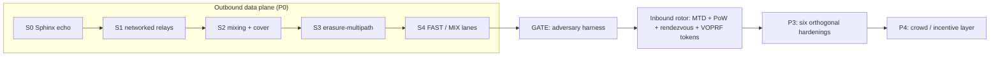

# Changelog

All notable changes to **Whirlpool** are documented here.

The format is based on [Keep a Changelog](https://keepachangelog.com/en/1.1.0/),
and this project aims to adhere to [Semantic Versioning](https://semver.org/spec/v2.0.0.html).

> [!NOTE]
> This is a **pre-1.0 research build**. No version has been **tagged or released**,
> and nothing is **published to crates.io**. Under SemVer, `0.y.z` is initial
> development: anything may change at any time, and the public API is not stable.
> The current workspace version is `0.0.1`.

> [!WARNING]
> Whirlpool is **early-stage and UNAUDITED**. Do **not** rely on it for real
> anonymity or safety yet. Every claim here is *measured before it is trusted*,
> and the honest ceilings live inline with the entries that earn them — not at the
> bottom. See [`docs/DESIGN.md`](docs/DESIGN.md) for the full threat model.

---

## Contents

- [Unreleased](#unreleased)
  - [Milestone status](#milestone-status)
  - [Added](#added)
  - [Deferred](#deferred-not-a-keep-a-changelog-category)
- [About versioning](#about-versioning)

---

## [Unreleased]

Whirlpool has been built **milestone by milestone**, entirely in the open. The
build history below is the real thing — a layered privacy-and-defense fabric with
**two rotors**: an *outbound* mixer that dissolves a person into a crowd, and an
*inbound* shield that hides and protects a system.

### Milestone status

- [x] **P0** outbound data plane (S0 → S4)
- [x] **GATE** partial-observer correlation harness (go/no-go)
- [x] **Inbound rotor** — MTD, PoW admission, rendezvous, VOPRF tokens
- [x] **P3** hardening — all six orthogonal additions
- [x] **P4** crowd / incentive layer
- [ ] **S5** QUIC/MASQUE transport swap — *deferred* (see below)

### Added

Entries are listed in the order they were built. Each capability claim carries its
honest ceiling inline, wherever one applies.

**P0 — Outbound data plane (protect a person)**

- **S0 — Sphinx onion echo.** `whirl-sphinx`, a typed wrapper over the audited
  `sphinx-packet` mix-packet format, with end-to-end onion encrypt/echo. Shared
  constants and types land in `whirl-common` (`FlowClass`, `DEFAULT_HOPS = 3`).
- **S1 — Networked relays.** `whirl-net` async transport, directory, and relay
  server carry the Sphinx onion over the wire (TCP length-prefixed frames). No
  single relay learns both ends; the onion is capped at 3 hops (D5).
- **S2 — Mixing + cover.** Per-hop Poisson mixing and Loopix shared cover traffic
  in `whirl-net`.
  *Ceiling:* Loopix global-observer resistance holds **only at mix latency**,
  never at low latency.
- **S3 — Erasure-coded multipath.** `whirl-fec` Reed–Solomon fragmentation and
  reassembly across paths.
  *Ceiling (D7):* this is **probabilistic middle-path hardening** against a
  *partial* observer — **not** a reconstruction threshold. Endpoints stay exposed,
  and spreading a message over more paths *widens* what a partial observer touches
  (measured under the GATE). It buys availability and content-splitting, not
  correlation resistance.
- **S4 — FAST / MIX adaptive lanes.** Per-flow choice between a low-latency **FAST**
  lane and a mixing **MIX** lane, sealed inside the onion (D8). The `whirl-node`
  demo spins up a testnet and times both lanes on the same route.

**The GATE (the go/no-go)**

- **GATE — adversary-emulation harness.** `whirl-adversary`, a partial-observer
  timing-correlation harness that emits a verdict. It is the instrument every
  later claim is checked against.
  

  
Measured verdict (quoted from the harness)

  | flows | window | mix/hop | accuracy | chance | note |
  |------:|-------:|--------:|---------:|-------:|------|
  | 50 | 1000ms | 0ms | 1.00 | 0.02 | baseline: no mixing (FAST lane) |
  | 50 | 1000ms | 50ms | 0.11 | 0.02 | MIX lane, healthy crowd |
  | 50 | 1000ms | 150ms | 0.04 | 0.02 | more mixing |
  | 5 | 1000ms | 150ms | 0.44 | 0.20 | same mixing, tiny crowd → barely helps |

  Multipath exposure — fraction of flows a partial observer on 20% of paths
  touches: single-path (k=1) `0.23`, multipath (k=3) `0.56`.

  **Verdict:** (1) mixing works and is the real correlation-resistance lever
  (`1.00` → near chance); (2) it is **gated on the crowd** (tiny crowd `0.44` —
  cleverness never manufactures anonymity); (3) multipath does **not** buy
  partial-observer correlation resistance — it *widens* exposure (`0.23` → `0.56`).
  

**Inbound rotor (protect a system)**

- **MTD ingress hopping + PoW admission.** `whirl-shield` moving-target-defense
  address hopping via `HMAC(key, time_window)`, plus proof-of-work admission.
  *Ceiling (D2):* rotation is **defense, not anonymity**.
- **Rendezvous origin-hiding.** Rendezvous-based origin hiding for the protected
  asset, so the origin never faces clients directly.
- **VOPRF capability tokens.** Unlinkable capability tokens (blind VOPRF, RFC 9497
  *shape*) complete the inbound rotor.
  *Ceiling:* this is a **hand-built PROTOTYPE** on `curve25519-dalek` primitives
  and is **UNAUDITED**. Anonymous credentials add **zero** intrinsic Sybil
  resistance — only the scarce resource (PoW / stake) does.

**P3 — Six orthogonal hardening additions** (added *by threat*, not by default;
a matrix, not a stack — D10). Shipped in landing order 1, 2, 4, 6, 5; Addition 3
(anonymous credentials) had already shipped as the VOPRF token above.

- **Addition 1 — Obfuscation / pluggable transports.** `whirl-obfs`: a
  pluggable-transport framework, transports, and an entropy meter.
  *Ceiling:* appearance only, **zero anonymity effect**. "Unblockable" is not
  claimed — obfuscation only makes blocking *more expensive than a censor will pay
  today*, and random-byte transports are themselves a positive entropy-DPI
  fingerprint.
- **Addition 2 — Endpoint hardening + data minimization.** `whirl-endpoint`:
  forward-secret ratchet, personas, uniform fingerprint.
  *Ceiling:* endpoint compromise (a login, a device, a fingerprint) deanonymises
  regardless of the network.
- **Addition 4 — Decentralization + attestation.** `whirl-directory`:
  threshold-signed consensus, equivocation detection, build attestation.
  *Ceiling:* **detection, not prevention** — reproducible builds prove
  *binary == source*, not that a relay actually runs that binary.
- **Addition 6 — Private directory retrieval.** `whirl-pir`: 2-server IT-PIR.
  *Ceiling:* **default OFF** — a full signed directory download is leak-free and
  cheaper; PIR is surgical, not the default path (D18).
- **Addition 5 — Deniability / steganography.** `whirl-stego`: LSB steganography.
  *Ceiling:* **situational** — LSB stego is trivially detectable.

**P4 — Crowd / incentive layer**

- **Crowd admission + Sybil pricing.** `whirl-crowd`: a k-anonymity admission
  governor and a staking Sybil-pricing model.
  *Ceiling:* the crowd is the binding constraint everywhere (D12, D20). Staking is
  **wealth concentration, not user-decentralization**, and adds no intrinsic Sybil
  resistance on its own.

**Tooling & quality gates**

- **Workspace.** 13 crates, 55 tests, all green. See [`README.md`](README.md) and
  [`docs/DESIGN.md`](docs/DESIGN.md).
- **Gates.** `cargo fmt --all -- --check`, `cargo clippy --workspace
  --all-targets -- -D warnings`, and `cargo test --workspace`. CI runs all three
  on every pull request and on pushes to `main`.
- **Integration hygiene (D11).** Cryptography and transport are built on audited,
  known-good crates (`sphinx-packet`, `x25519-dalek`, `curve25519-dalek`,
  `ed25519-dalek`, `reed-solomon-erasure`, `hmac`, `sha2`, `zeroize`, `tokio`)
  rather than rolled from scratch. The VOPRF token construction is the one
  exception — hand-built on those audited `curve25519-dalek` primitives — and it is
  flagged as an unaudited prototype above.

### Deferred (not a Keep a Changelog category)

- **S5 — QUIC/MASQUE transport swap.** Deferred as low-value, high-risk plumbing.
  TCP length-prefixed frames work today, and the swap has **no bearing on the
  anonymity properties**. This is the only outstanding milestone item.

---

## About versioning

No release has been cut. When one is, it will appear here as a dated
`## [x.y.z]` heading above **Unreleased**, following
[Keep a Changelog](https://keepachangelog.com/en/1.1.0/). Because this is a 2026
research build and precise per-commit dates are not part of this record, entries
are undated (or attributed to **2026**) rather than assigned specific days.

Whirlpool's whole identity is refusing to overclaim. The recurring lesson across
every milestone above is the same one the GATE measured: **anonymity is the size
of the concurrent crowd**, and no amount of engineering manufactures it.
