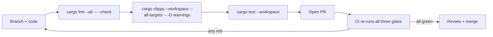

# Contributing to Whirlpool

[](https://github.com/rupeshbharambe24/Whirlpool/actions/workflows/ci.yml)
[](LICENSE)
[](Cargo.toml)
[](#the-workspace-at-a-glance)
[](#the-workspace-at-a-glance)
[](#project-ethos)

Thanks for your interest in **Whirlpool** — a layered privacy-and-defense network
fabric with two rotors: an **outbound mixer** that dissolves a person into a crowd,
and an **inbound shield** that hides and protects a system. This guide covers how we
build, what we measure, and the bar a change has to clear before it merges.

> [!IMPORTANT]
> Whirlpool is **early research and EXPERIMENTAL. It is UNAUDITED.** Do **not** rely
> on it for real anonymity or safety yet. Contributions are welcome precisely because
> the project is being built in the open, milestone by milestone — every claim is
> measured before it is trusted.

---

## Table of contents

1. [Project ethos](#project-ethos)
2. [The workspace at a glance](#the-workspace-at-a-glance)
3. [Prerequisites](#prerequisites)
4. [Local development](#local-development)
5. [Before you open a PR](#before-you-open-a-pr)
6. [Adding a milestone or crate](#adding-a-milestone-or-crate)
7. [Commit & PR conventions](#commit--pr-conventions)
8. [Documentation changes](#documentation-changes)
9. [Code of Conduct](#code-of-conduct)
10. [License](#license)

---

## Project ethos

Three rules shape every contribution. They are not slogans — they are how we decide
whether a change is allowed in.

### 1. Measurement-gated

**Every step ends with a number against a baseline.** A feature is not "done" because
it compiles and the story sounds good; it is done when a test or a demo prints a
measurement that shows what it bought — and, just as importantly, what it did *not*.
The canonical example is the adversary harness (`whirl-adversary`, "THE GATE"): it
runs a partial-observer timing-correlation sweep and emits a verdict. Mixing takes an
attacker's correlation accuracy from `1.00` (no mixing) down toward chance — but only
in a healthy crowd. That number is the point, not the prose around it.

### 2. Never roll your own crypto or transport

**Integrate audited crates; do not reinvent primitives** (design decision **D11**).
Whirlpool is an *integration*, not a from-scratch cryptosystem. We build on top of:

| Concern | Crate we integrate |
| --- | --- |
| Sphinx mix-packet format | `sphinx-packet` 0.7.0 (Nym-audited) |
| X25519 / Curve25519 | `x25519-dalek` 3.0, `curve25519-dalek` 5 |
| Ed25519 signatures | `ed25519-dalek` 3 |
| Erasure coding | `reed-solomon-erasure` 6 |
| HMAC / hashing | `hmac` 0.13, `sha2` 0.11 |
| Secret hygiene | `zeroize` 1 (derive) |
| Async transport | `tokio` 1 |

> [!WARNING]
> The one hand-built cryptographic construction is the **VOPRF capability token** in
> `whirl-shield` — a prototype on `curve25519-dalek` primitives following the RFC 9497
> shape. It is **UNAUDITED**. Any doc, comment, or PR that mentions tokens must say so.

### 3. Honesty over hype

The project's whole identity is **refusing to overclaim**. Physics ceilings go
**in-line, next to the claim**, never buried in a footnote:

- Whirlpool **cannot** beat a **global passive observer** at low latency. Nobody can.
- Anonymity **is** the size of the concurrent anonymity set — cleverness never
  manufactures a crowd.
- The [anonymity trilemma](docs/DESIGN.md) is real: strong anonymity, low latency, low
  overhead — pick about two.
- **Endpoint compromise** (a login, a device, a fingerprint) deanonymises you
  regardless of what the network does.

Before you write a benchmark or a headline, read the anti-overclaim rules in
[docs/DESIGN.md § "What we can and cannot claim"](docs/DESIGN.md#7-what-we-can-and-cannot-claim).
They are project law.

---

## The workspace at a glance

Thirteen crates, **one crate per orthogonal concern**, 55 tests, all green.

| Crate | Purpose | Tests |
| --- | --- | :---: |
| `whirl-common` | shared constants & types (`FlowClass`, `DEFAULT_HOPS = 3`) | 3 |
| `whirl-sphinx` | typed wrapper over the audited Sphinx mix-packet format | 5 |
| `whirl-fec` | Reed-Solomon erasure coding: fragment a message, reassemble any *m* | 4 |
| `whirl-net` | async transport, directory, relay server, mixing, cover traffic | 4 |
| `whirl-node` | demo binary: spin up a testnet + integration tests (lanes, multipath) | 2 |
| `whirl-adversary` | **THE GATE**: partial-observer timing-correlation harness + verdict | 4 |
| `whirl-shield` | inbound rotor: MTD hopping, PoW admission, rendezvous, capability tokens | 11 |
| `whirl-obfs` | pluggable-transport framework + transports + an entropy meter | 4 |
| `whirl-endpoint` | endpoint hardening: forward-secret ratchet, personas, uniform fingerprint | 3 |
| `whirl-directory` | threshold-signed consensus, equivocation detection, build attestation | 5 |
| `whirl-pir` | private directory retrieval: 2-server IT-PIR (default is full download) | 3 |
| `whirl-stego` | deniability: LSB steganography (situational; honest limits) | 4 |
| `whirl-crowd` | k-anonymity admission governor + staking Sybil-pricing model | 3 |
| **Total** | | **55** |

These three numbers — **13 crates / 55 tests / the GATE verdict** — are ground truth.
See [Documentation changes](#documentation-changes) for keeping them consistent.

---

## Prerequisites

You need a **stable Rust** toolchain installed via [`rustup`](https://rustup.rs/).

- **MSRV (`rust-version`): 1.85**, edition 2021.
- The repo **pins its toolchain** in [`rust-toolchain.toml`](rust-toolchain.toml). When
  you run any `cargo` command inside the repo, `rustup` reads that file and
  automatically selects the `stable` channel with the `rustfmt` and `clippy`
  components — the same toolchain CI uses. You do not need to configure anything.

```toml
# rust-toolchain.toml (already in the repo — shown for reference)
[toolchain]
channel = "stable"
components = ["rustfmt", "clippy"]
```

> [!TIP]
> If `rustup` is already installed, `rustup show` inside the repo confirms it picked up
> the pinned `stable` toolchain plus `rustfmt` and `clippy`. No nightly is required.

---

## Local development

```bash
# 1. Clone
git clone https://github.com/rupeshbharambe24/Whirlpool.git
cd Whirlpool

# 2. Build the whole workspace (rustup auto-selects the pinned stable toolchain)
cargo build --workspace

# 3. Test the whole workspace (all 55 tests should pass)
cargo test --workspace

# 4. Run a single crate's tests while iterating (example: the inbound rotor)
cargo test -p whirl-shield

# 5. Run the demos — each prints its mechanism and its HONEST ceiling
cargo run -p whirl-adversary   # THE GATE: correlation sweep + multipath exposure report
cargo run -p whirl-shield      # inbound rotor: MTD ingress hopping + PoW admission
cargo run -p whirl-node        # FAST vs MIX lanes on the same route, timed
cargo run -p whirl-crowd       # k-anon admission governor + staking Sybil-pricing
cargo run -p whirl-obfs        # pluggable transport + entropy meter (appearance only)
cargo run -p whirl-endpoint    # forward-secret ratchet, personas, uniform fingerprint
cargo run -p whirl-directory   # threshold-signed consensus + equivocation detection
cargo run -p whirl-pir         # 2-server IT-PIR (default OFF: full signed download)
cargo run -p whirl-stego       # LSB steganography (situational; trivially detectable)
```

<details>
<summary>Which crates have a runnable demo?</summary>

Nine crates ship a `main.rs` demo binary (the nine `cargo run -p …` lines above). Four
are **lib-only** and have no demo — exercise them through `cargo test`:

- `whirl-common`
- `whirl-sphinx`
- `whirl-fec`
- `whirl-net`

</details>

> [!NOTE]
> The GATE demo (`cargo run -p whirl-adversary`) is the one to read first. It shows,
> with numbers, why mixing is the real correlation-resistance lever, why a tiny crowd
> guts it, and why multipath **widens** partial-observer exposure rather than shrinking
> it. If your change touches the data plane, its story has to survive that report.

---

## Before you open a PR

There are **three gates**. They are **CI-enforced** on every pull request and on
pushes to `main` — if any one of them fails, the PR cannot merge. Run all three
locally first; they are exactly what CI runs, so a green local run means a green
pipeline.

```bash
# Gate 1 — formatting (must already be rustfmt-clean; --check makes no changes)
cargo fmt --all -- --check

# Gate 2 — lint with WARNINGS AS ERRORS (-D warnings). Clippy must be silent.
cargo clippy --workspace --all-targets -- -D warnings

# Gate 3 — the full test suite (all 55 tests)
cargo test --workspace
```

| Gate | Command | What it enforces |
| --- | --- | --- |
| 1. Format | `cargo fmt --all -- --check` | Canonical `rustfmt` style, no diffs |
| 2. Lint | `cargo clippy --workspace --all-targets -- -D warnings` | **Zero warnings** — every warning is a hard error |
| 3. Test | `cargo test --workspace` | Behavior is correct; nothing regressed |



> [!WARNING]
> `-D warnings` means clippy warnings are **errors**. Do not silence a lint with a
> blanket `#[allow(...)]` to get past the gate — fix the code, or, if the lint is
> genuinely wrong for a specific line, add a **narrowly scoped** `#[allow]` with a
> comment explaining why. A green CI run is a claim that the code is clean; keep it
> honest.

Pre-PR checklist:

- [ ] `cargo fmt --all -- --check` is clean
- [ ] `cargo clippy --workspace --all-targets -- -D warnings` is silent
- [ ] `cargo test --workspace` is green (55 tests, or 55 + your new ones)
- [ ] New behavior is covered by a test that asserts **behavior, not timing**
- [ ] No overclaim introduced (see [Documentation changes](#documentation-changes))

---

## Adding a milestone or crate

Whirlpool grows by **milestones**, and the unit of a milestone is usually a crate. The
pattern is deliberate — follow it so the workspace stays legible.

### The pattern

1. **One crate per orthogonal concern.** Whirlpool is a *matrix* of independent
   defenses, not a stack (decision **D10**). A new concern gets its own crate under
   `crates/whirl-<name>` and its own line in the workspace `members` list; it should
   not bolt itself onto an existing crate's responsibilities.
2. **A `lib.rs` with an honest module doc-comment that states the ceiling.** The very
   top of the crate (`//!` doc) says what the mechanism does *and* what it cannot do.
   The limit is a first-class part of the API surface, not an afterthought.
3. **Tests that assert behavior, not timing.** Wall-clock timing is machine-dependent
   and flaky in CI. Assert the *property* — "reassembles from any *m* fragments",
   "rejects an admission below the PoW threshold", "detects an equivocating signer" —
   never "finished in under N milliseconds". Timing belongs in a demo's printout, not
   in a test assertion.
4. **An optional `main.rs` demo that prints the honest ceiling.** If the crate benefits
   from a runnable story, add a demo that prints its mechanism *and* the ceiling in the
   same breath. Lib-only crates (like `whirl-common`, `whirl-sphinx`, `whirl-fec`,
   `whirl-net`) skip this and prove themselves through tests.

### Skeleton for a new crate

```rust
//! # whirl-foo — <one honest line: what this concern is>
//!
//! Mechanism: <what it actually does>.
//!
//! Ceiling (READ THIS): <what it does NOT buy — stated plainly, in-line>.
//! For example: "appearance only; zero anonymity effect", or "detection, not
//! prevention", or "situational — trivially detectable under <condition>".
//!
//! This crate is EXPERIMENTAL and UNAUDITED like the rest of Whirlpool.

// ... public API ...

#[cfg(test)]
mod tests {
    use super::*;

    #[test]
    fn asserts_a_property_not_a_duration() {
        // Assert the behavior/invariant. Never assert wall-clock timing.
    }
}
```

```toml
# crates/whirl-foo/Cargo.toml — inherit workspace-pinned versions
[package]
name = "whirl-foo"
version.workspace = true
edition.workspace = true
rust-version.workspace = true
license.workspace = true
repository.workspace = true

[dependencies]
# Pull audited crates from [workspace.dependencies] — never a fresh primitive (D11).
```

> [!NOTE]
> Adding a crate changes the ground-truth counts. If crate #14 lands with its own
> tests, the "13 crates / 55 tests" numbers move **together, everywhere** — see the
> next section.

---

## Commit & PR conventions

- **Concise, imperative subject line.** "Add entropy meter to whirl-obfs", not "Added…"
  or "This commit adds…". Aim for ~50 characters; put detail in the body.
- **Reference the milestone.** Mention the phase/milestone or the crate the change
  belongs to (e.g. `P3`, `GATE`, `whirl-shield`) in the subject or body so history stays
  navigable.
- **Keep diffs focused.** One concern per PR. Formatting churn, drive-by renames, and an
  unrelated feature do not belong in the same diff — they make review and `git bisect`
  harder. Split them.

| Do | Don't |
| --- | --- |
| `Add PoW admission threshold to whirl-shield` | `updates` |
| `Fix off-by-one in whirl-fec reassembly (any m)` | `fixed a bug and also reformatted everything` |
| `whirl-crowd: gate admission on k-anon set size` | `WIP misc changes` |

**Pull requests** should say what changed, which milestone/crate it touches, and — in
keeping with the ethos — **what you measured**. If the change affects the data plane,
include the relevant demo output (especially the GATE report). A PR that claims a
security or performance improvement without a number is incomplete.

---

## Documentation changes

Docs are held to the same honesty bar as code.

- **Keep the ground-truth numbers consistent across every doc.** The canonical values
  are **13 crates**, **55 tests**, and the **GATE** verdict below. If you change any of
  them, grep the repo and update *all* occurrences in the same PR — a doc that says "12
  crates" or "54 tests" is a bug.
- **Never introduce an overclaim.** Before writing any comparative or absolute claim,
  re-read the anti-overclaim rules in
  [docs/DESIGN.md § "What we can and cannot claim"](docs/DESIGN.md#7-what-we-can-and-cannot-claim).
  A few that catch people:
  - Say "**match / modest win vs modern Tor**", never "beat Tor on speed" unqualified.
  - Never sum inbound-protected clients into the outbound anonymity-set number.
  - **Multipath = probabilistic middle-path hardening, not a reconstruction threshold.**
  - "**Unblockable**" is banned; obfuscation buys "more expensive to block than the
    censor will pay today".
  - Anonymous credentials / staking add **zero** intrinsic Sybil resistance — the scarce
    resource (PoW/stake) does.

### The GATE — the numbers, quoted exactly

These are the go/no-go measurements. Reproduce them with `cargo run -p whirl-adversary`.

| flows | window | mix/hop | accuracy | chance | note |
| :---: | :---: | :---: | :---: | :---: | --- |
| 50 | 1000ms | 0ms | 1.00 | 0.02 | baseline: no mixing (FAST lane) |
| 50 | 1000ms | 50ms | 0.11 | 0.02 | MIX lane, healthy crowd |
| 50 | 1000ms | 150ms | 0.04 | 0.02 | more mixing |
| 5 | 1000ms | 150ms | 0.44 | 0.20 | same mixing, tiny crowd → barely helps |

**Multipath exposure** — fraction of flows a partial observer on 20% of paths touches:

| paths | exposure |
| --- | :---: |
| single-path (k=1) | 0.23 |
| multipath (k=3) | 0.56 |

**Verdict:** (1) mixing works and is the real correlation-resistance lever (`1.00 →`
near chance). (2) It is **gated on the crowd** (tiny crowd `0.44` — cleverness never
manufactures anonymity). (3) Multipath does **not** buy partial-observer correlation
resistance — it **widens** exposure (`0.23 → 0.56`); it buys availability and
content-splitting (decision **D7**).

> [!IMPORTANT]
> If a code change moves any of these numbers, the doc numbers move **with it, in the
> same PR**. The measurement is the source of truth; the docs report it.

---

## Code of Conduct

The full policy is in [`CODE_OF_CONDUCT.md`](CODE_OF_CONDUCT.md) (Contributor
Covenant v2.1). The short version:

- **Be respectful, be honest, assume good faith.** Technical disagreement is welcome;
  personal attacks, harassment, and bad-faith conduct are not.
- **No overclaiming in discussion either.** This is a security-research project — do not
  present unverified results, exaggerated capabilities, or "unbreakable" framing in
  issues, PRs, or reviews. Bring the measurement.
- **Scope.** These expectations apply in all project spaces: issues, pull requests, code
  review, and commit history.
- **Reporting.** Conduct concerns can be raised via a GitHub **Issue**, or, if the
  matter is sensitive, privately to the maintainer **[@rupeshbharambe24](https://github.com/rupeshbharambe24)**.
  For **security vulnerabilities**, do **not** open a public issue — use GitHub's
  **private vulnerability reporting** (Security Advisories) on the repository instead.

The maintainer may edit, remove, or reject contributions and comments that violate these
expectations.

---

## License

Whirlpool is licensed under the **MIT License** — see [`LICENSE`](LICENSE).

**By contributing, you agree that your contributions are licensed under MIT** © 2026
rupeshbharambe24. If you are not able to license your contribution under these terms,
please do not submit it.

---

<sub>Maintainer: <a href="https://github.com/rupeshbharambe24">@rupeshbharambe24</a> ·
Repo: <a href="https://github.com/rupeshbharambe24/Whirlpool">rupeshbharambe24/Whirlpool</a> ·
Status: experimental, unaudited · See <a href="README.md">README</a> and
<a href="docs/DESIGN.md">docs/DESIGN.md</a>.</sub>
