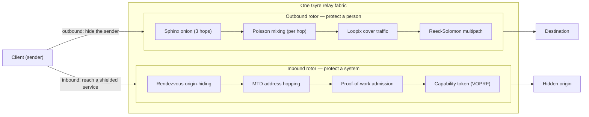

# Gyre

**A layered privacy-and-defense network fabric — one fabric, two rotors.**

[](https://github.com/rupeshbharambe24/Gyre/actions/workflows/ci.yml)
[](LICENSE)


Gyre is a single relay fabric that spins two ways at once: an **outbound
mixer** that dissolves a person into a crowd, and an **inbound shield** that
hides and protects a system. Tor is the proof-of-concept that one relay fabric
can host both — client anonymity *and* onion-service origin-hiding.

> [!WARNING]
> **Early research. Experimental. Unaudited.** Do **not** rely on Gyre for
> real anonymity or safety yet. It is being built in the open, milestone by
> milestone, and every claim is *measured* before it is trusted. The one
> hand-built cryptographic construction (the VOPRF capability token) is an
> unaudited prototype — treated as such wherever it appears.

---

## Contents

- [What it is (honestly)](#what-it-is-honestly)
- [Overview: one fabric, two rotors](#overview-one-fabric-two-rotors)
- [The two rotors](#the-two-rotors)
- [Quickstart](#quickstart)
- [Crate map](#crate-map)
- [The GATE: what the measurement actually says](#the-gate-what-the-measurement-actually-says)
- [Roadmap](#roadmap)
- [Documentation](#documentation)
- [Design principle](#design-principle)
- [Contributing](#contributing)
- [Security](#security)
- [License](#license)

---

## What it is (honestly)

Gyre is **not** a magic anonymity box, and it cannot beat physics. The
ceilings come first, on purpose:

- It **cannot beat a global passive observer at low latency.** Nobody can.
- It **cannot manufacture anonymity without a crowd** — anonymity *is* the size
  of the concurrent anonymity set.
- It **respects the anonymity trilemma:** strong anonymity, low latency, low
  overhead — pick about two.
- **Endpoint compromise deanonymises** regardless of the network. A login, a
  device, or a fingerprint undoes everything upstream of it.

What it *can* be is a **well-integrated** fabric built from established, widely-used
primitives, tuned for a **named adversary** — a *partial* network observer that
sees some links and correlates by timing, plus a censoring ISP and Sybil relay
operators — with one thing no anonymity network offers alongside a
competitive-by-design outbound rotor (the crowd is still the binding constraint):
an **inbound server-protection rotor**. See
[`docs/DESIGN.md`](docs/DESIGN.md) for the full picture and the honest ceilings.

**Threat model in one line:** the primary target is a partial observer; a
censoring ISP (obfuscation) and Sybil operators (PoW / stake / reputation) are
in scope; the global passive observer at low latency is explicitly *out* of
scope; an endpoint attacker is mitigated, never fully solved.

---

## Overview: one fabric, two rotors

One set of relays, two directions of protection. The **outbound** path protects
a *person* by dissolving them into a crowd; the **inbound** path protects a
*system* by hiding its origin behind the same fabric.



---

## The two rotors

### Outbound — protect a person

Dissolves a sender into the concurrent crowd. No single relay ever sees both
ends of a flow.

- **Sphinx onion routing (3 hops)** over the `sphinx-packet` format —
  each hop peels one layer, learns only the next hop, never the whole path.
- **Per-hop Poisson mixing** — every relay holds a packet for an independent
  exponential delay, so packets can leave in a different order than they arrived.
- **Loopix cover traffic** — clients emit cover "loops" that are byte-for-byte
  indistinguishable on the wire from real traffic.
- **Reed–Solomon erasure-coded multipath** — a message is split `m`-of-`k` and
  the fragments travel disjoint paths; any `m` reassemble it. Honest framing
  (**D7**): this hardens the *middle path* against a partial observer — it is
  **not** a reconstruction-threshold guarantee, and endpoints stay exposed.
- **Adaptive FAST / MIX lanes** — a per-flow dial: FAST is onion-only (near-zero
  added delay, Tor-class latency); MIX pays the Poisson delay for stronger timing
  resistance. Honest ceiling (**D8 / D21**): a partial observer can still separate
  the lanes by their delay distribution, so FAST and MIX partition the anonymity
  set rather than sharing one crowd.

### Inbound — protect a system

Hides and gates a service's origin behind the fabric. The origin publishes **no
inbound address**.

- **Rendezvous origin-hiding** — the origin dials *out* to a rendezvous relay and
  waits behind a shared cookie; the relay splices it to a client presenting the
  same cookie, copying opaque bytes between them. The relay learns neither
  endpoint nor the end-to-end-encrypted content — a trust topology a reverse-proxy
  CDN structurally cannot offer.
- **Moving-target-defense (MTD) address hopping** — the public ingress is
  `HMAC(key, time_window)`, so an authorized client and the origin agree on it
  while a scanner cannot pre-target it. Honest ceiling (**D22**): MTD serves a
  *closed, authorized* client set, not the open web.
- **Proof-of-work admission** — difficulty scales with load; the server verifies
  in one hash. It re-prices attacker asymmetry but does nothing for L3/L4
  volumetric floods.
- **Unlinkable capability tokens** — **RFC 9497 VOPRF** (`ristretto255-SHA512`) via the
  [`voprf`](https://crates.io/crates/voprf) crate (unaudited — see
  [`SECURITY.md`](SECURITY.md)). **Not yet bound to admission** (finding F14): issuance is
  open to anyone who can reach the issuer, so today the token grants no scarcity — the
  design below is what the mechanism is *for*, not what it currently enforces. A client that
  paid once redeems
  a token to skip the PoW, and the issuer — which only ever saw a random *blinded* point —
  cannot link redemption to issuance. Single-use; double-spend rejected. The issuer must
  attach a **DLEQ proof** that it used its published key, and the client pins that key from
  the **threshold-signed consensus** — without both, a malicious issuer deanonymises every
  client by handing out a different key each time. That was a real, reproduced flaw in an
  earlier hand-rolled version; see [`docs/AUDIT.md`](docs/AUDIT.md). The construction is now
  an upstream library rather than ours — but **neither it nor the integration around it has
  been audited**; see [`SECURITY.md`](SECURITY.md).

---

## Quickstart

Requires a stable Rust toolchain (MSRV **1.85**). Everything below runs offline.

```bash
# Build the whole workspace
cargo build --workspace

# Gates (exactly what CI runs on every push / PR).
# `cargo test` runs the unit tests AND the proptest property suite, which includes a
# "parsing arbitrary bytes never panics" property for every untrusted-input parser.
cargo test  --workspace
cargo fmt   --all -- --check
cargo clippy --workspace --all-targets -- -D warnings

# A real testnet: three relays as SEPARATE PROCESSES on real sockets.
# Mixing visibly reorders packets between them — the mechanism, not a model.
./scripts/testnet.sh 8 mix

# End-to-end simulation: the REAL protocol code under an OPTIMAL correlation
# attacker. This supersedes the GATE numbers — see docs/SIMULATION.md.
cargo run --release -p gyre-sim

# Primitive microbenchmarks (criterion) — see BENCHMARKS.md for numbers + caveats
cargo bench -p gyre-benches

# Coverage-guided fuzzing (needs nightly + `cargo install cargo-fuzz`)
cargo +nightly fuzz run sphinx_packet_parse

# --- Runnable demos (each prints its mechanism + the honest ceiling) ---

# The GATE: partial-observer correlation sweep + multipath exposure
cargo run -p gyre-adversary

# Inbound rotor: MTD ingress hopping + PoW admission
cargo run -p gyre-shield

# FAST vs MIX lanes on the same route, timed
cargo run -p gyre-node

# k-anonymity admission governor + staking Sybil-pricing model
cargo run -p gyre-crowd

# Hardening demos
cargo run -p gyre-obfs        # pluggable transport + entropy meter
cargo run -p gyre-endpoint    # forward-secret ratchet + personas
cargo run -p gyre-directory   # threshold-signed consensus + attestation
cargo run -p gyre-pir         # 2-server IT-PIR directory retrieval
cargo run -p gyre-stego       # LSB steganography (situational)
```

> [!NOTE]
> Four crates are library-only and have **no demo binary**: `gyre-common`,
> `gyre-sphinx`, `gyre-fec`, `gyre-net`. Exercise them with
> `cargo test --workspace`.

---

## Crate map

Fifteen crates, 171 tests, all green.

| Crate | Purpose | Tests |
|---|---|:--:|
| `gyre-common` | Shared constants & types (`FlowClass`, `DEFAULT_HOPS = 3`) | 3 |
| `gyre-sphinx` | Typed wrapper over the `sphinx-packet` mix-packet format | 5 |
| `gyre-fec` | Reed–Solomon erasure coding: fragment a message, reassemble any `m` | 4 |
| `gyre-net` | Async transport (TCP + QUIC), directory, relay server, mixing, cover traffic | 14 |
| `gyre-node` | Demo binary: spin up a testnet + integration tests (lanes, multipath) | 2 |
| `gyre-adversary` | **The GATE:** partial-observer timing-correlation harness + verdict | 4 |
| `gyre-shield` | Inbound rotor: MTD hopping, PoW admission, rendezvous, capability tokens | 42 |
| `gyre-obfs` | Pluggable-transport framework + transports + an entropy meter | 4 |
| `gyre-endpoint` | Endpoint hardening: forward-secret ratchet, personas, uniform fingerprint | 3 |
| `gyre-directory` | Threshold-signed consensus, typed network params, equivocation detection | 21 |
| `gyre-pir` | Private directory retrieval: 2-server IT-PIR (default is full download) | 3 |
| `gyre-stego` | Deniability: LSB steganography (situational; honest limits) | 4 |
| `gyre-crowd` | P4: k-anonymity admission governor + staking Sybil-pricing model | 8 |
| `gyre-sim` | Simulation harness: real code over a modelled network + an **optimal** correlation attacker | 19 |
| `gyre-cli` | Standalone `gyre-relay` / `gyre-client` / `gyre-sink` binaries — real processes on real sockets | 4 |
| **Total** | | **55** |

---

## The GATE: what the measurement actually says

> [!WARNING]
> **These GATE numbers are optimistic and have been superseded.** The harness below
> models each flow as a *single message* and attacks it with a *greedy* matcher — two
> choices that both make anonymity look better than it is. Measured properly, with
> multi-packet streams and an **optimal maximum-likelihood attacker** against the real
> Sphinx implementation, the MIX lane at 50 ms/hop scores **≈ 0.50**, not `0.11` —
> about **4.5× worse** than this table reports. See
> [`docs/SIMULATION.md`](docs/SIMULATION.md) for the corrected figures and the method.
> The table is kept because it remains a fast, deterministic regression signal for the
> *mechanism* — it is no longer the basis for an anonymity claim.

This is the original go/no-go. A deterministic timing model runs a *partial observer*
correlation attack over many concurrent flows and measures accuracy against a
baseline. The numbers are quoted verbatim from the harness.

```text
 flows   window   mix/hop   accuracy   chance   note
   50    1000ms      0ms      1.00      0.02    baseline: no mixing (FAST lane)
   50    1000ms     50ms      0.11      0.02    MIX lane, healthy crowd
   50    1000ms    150ms      0.04      0.02    more mixing
    5    1000ms    150ms      0.44      0.20    same mixing, tiny crowd -> barely helps

multipath exposure — fraction of flows a partial observer (on 20% of paths) touches:
  single-path (k=1): 0.23
  multipath  (k=3): 0.56
```

The honest verdict this produces — and it matches the design analysis:

1. **Mixing works, and it is the real correlation-resistance lever.** With no
   mixing a timing observer links flows *perfectly* (1.00); with MIX-lane delay it
   collapses to near chance (0.04).
2. **But it is gated on the crowd.** The same mixing with only a handful of
   concurrent flows barely helps (0.44). Cleverness never manufactures anonymity —
   concurrent traffic does.
3. **Multipath does *not* buy partial-observer correlation resistance** — it
   *widens* exposure (0.23 → 0.56). It buys availability and content-splitting, per
   **D7**.

### Measured against a real attacker

Findings (1) and (2) survive the stronger measurement; the *magnitudes* do not.
Running the real Sphinx/Loopix code with multi-packet circuits and an optimal
maximum-likelihood attacker ([`gyre-sim`](crates/gyre-sim)):

| mix / hop | optimal attacker | greedy attacker | chance |
|---:|---:|---:|---:|
| 0 ms (FAST) | **1.000** | 0.949 | 0.0067 |
| 50 ms (MIX) | **0.497** | 0.282 | 0.0067 |
| 150 ms (MIX) | **0.057** | 0.028 | 0.0067 |
| 500 ms (MIX) | **0.021** | 0.016 | 0.0067 |

Two things this changes, stated plainly:

- **FAST is a performance lane, not an anonymity lane.** Against an observer holding
  both ends it links *every* stream.
- **The default 50 ms MIX setting still loses about half of them.** Real resistance
  starts around 150 ms/hop — messaging latency, not browsing latency.

```bash
cargo run --release -p gyre-sim      # reproduce; full write-up in docs/SIMULATION.md
```

---

## Roadmap

**All phases complete.** Both rotors are done, end to end, with a measurement
GATE between claim and trust. The only deferred item is a transport swap with no
bearing on anonymity properties.

<details>
<summary><b>Full milestone task list</b> (P0 · GATE · inbound · P3 · P4 · S5)</summary>

### P0 — outbound data plane
- [x] **S0 — Sphinx onion echo.** Wrap a payload, process it hop-by-hop; no relay
  sees both ends, the exit recovers the exact payload.
- [x] **S1 — networked relays.** Each relay is an async server; an onion really
  travels client → relay → relay → exit → destination, resolving next hops through
  a directory. (Transport: length-prefixed frames over async TCP.)
- [x] **S2 — mixing + cover traffic.** Per-hop Poisson delay for reordering; Loopix
  cover loops indistinguishable on the wire from real traffic.
- [x] **S3 — erasure-coded multipath.** Reed–Solomon `m`-of-`k` fragments, each in
  its own onion on a disjoint path; reassemble from any `m` (**D7**).
- [x] **S4 — FAST / MIX adaptive lanes.** Per-flow latency/resistance dial, sealed
  in the onion (**D8 / D21**).

### GATE
- [x] **Adversary-emulation harness.** Partial-observer correlation sweep +
  multipath exposure. The go/no-go, measured honestly.

### Inbound rotor
- [x] **MTD address hopping** via `HMAC(key, window)` (**D22**).
- [x] **Proof-of-work admission** (load-scaled difficulty, one-hash verify).
- [x] **Rendezvous origin-hiding** (origin dials out; relay learns nothing).
- [x] **Unlinkable VOPRF capability tokens** (RFC 9497 shape; unaudited prototype).

### P3 — six orthogonal hardening additions (add by threat, not by default)
- [x] **1 · Obfuscation / pluggable transport** (`gyre-obfs`) — appearance only;
  zero anonymity effect. Entropy meter shows the honest ceiling.
- [x] **2 · Endpoint isolation + data minimization** (`gyre-endpoint`).
- [x] **3 · Anonymous credentials** — delivered *as* the VOPRF token in
  `gyre-shield`.
- [x] **4 · Decentralization + attestation** (`gyre-directory`) — detection, not
  prevention.
- [x] **5 · Deniability / steganography** (`gyre-stego`) — situational; LSB stego
  is trivially detectable.
- [x] **6 · PIR for directory lookups** (`gyre-pir`) — **default OFF**; the full
  signed download is leak-free and cheaper.

### P4 — crowd / incentive layer (the binding constraint)
- [x] **k-anonymity admission governor** — refuses to promise anonymity below a
  safe concurrent set size (admit / batch / refuse; it will not lie).
- [x] **Staking Sybil-pricing model** — prices a takeover (`stake_to_control`),
  penalizes stake-splitting via a self-bond premium. Trades Sybil resistance for
  wealth concentration; neither piece *makes* a crowd.

### S5 — QUIC transport
- [x] **QUIC transport with consensus-pinned relay certificates** — *as a library
  (`gyre_net::quic`), tested but **not yet reachable from any binary***. Relays have no CA
  certificates, so a client pins the **SHA-256 fingerprint published in the threshold-signed
  consensus** and refuses anything else — signature verification is delegated to `rustls`,
  never stubbed. Honest scope: this is a **performance and authentication** change, **not**
  an anonymity one.
  > **Status, stated precisely.** Every shipped binary (`gyre-relay`, `gyre-client`,
  > `gyre-sink`) is **TCP-only**; nothing in `crates/gyre-cli` imports `gyre_net::quic`. The
  > verifier and the pinning logic are real and tested — the wiring is not written. An
  > earlier version of this list claimed per-circuit streams end cross-circuit head-of-line
  > blocking; that claim is **withdrawn**, because `send_framed` opens a *new connection per
  > message*, and without a shared connection there is no shared congestion context in which
  > that blocking could occur. It cannot be true until the transport is wired in and
  > measured. See [Wiring QUIC into the binaries](docs/ROADMAP.md).
- [ ] **MASQUE (RFC 9298 CONNECT-UDP)** — tunnelling inside real HTTP/3 to look like
  ordinary web traffic. A censorship-resistance feature that belongs with `gyre-obfs`;
  **not implemented**, and not assumed present anywhere.

</details>

---

## Documentation

| Document | What's in it |
|---|---|
| [`docs/DESIGN.md`](docs/DESIGN.md) | The full design, the decisions log (D1–D22), and the honest ceilings |
| [`docs/ARCHITECTURE.md`](docs/ARCHITECTURE.md) | How the crates fit together and data flows through the fabric |
| [`docs/ROADMAP.md`](docs/ROADMAP.md) | Milestone history and what "complete" means for each phase |
| [`docs/GLOSSARY.md`](docs/GLOSSARY.md) | Terms of art: mixnet, Loopix, VOPRF, MTD, anonymity set, and friends |
| [`docs/SIMULATION.md`](docs/SIMULATION.md) | **End-to-end results**: `gyre-sim` (optimal attacker) **and Shadow** (real binaries, real TCP) — supersedes the GATE numbers |
| [`docs/AUDIT.md`](docs/AUDIT.md) | **Cryptographic audit package**: spec, security model, RFC deviations, self-review findings, test vectors |
| [`BENCHMARKS.md`](BENCHMARKS.md) | Reproducible criterion microbenchmarks of the primitives (with honest caveats) |
| [`CONTRIBUTING.md`](CONTRIBUTING.md) | How to build, test, and propose changes |
| [`SECURITY.md`](SECURITY.md) | How to report a vulnerability (GitHub private advisories) |
| [`CODE_OF_CONDUCT.md`](CODE_OF_CONDUCT.md) | Community expectations |
| [`CHANGELOG.md`](CHANGELOG.md) | What changed, release by release |

---

## Design principle

> [!IMPORTANT]
> **Never roll your own crypto or transport (D11).** The risky parts are established
> crates we integrate, not code we invent. Gyre's value is in *combining*
> known-good primitives well and *measuring* honestly.

Integrated known-good building blocks: `sphinx-packet 0.7.0` (Nym-audited
Sphinx), `x25519-dalek 3.0`, `curve25519-dalek 5`, `ed25519-dalek 3`,
`reed-solomon-erasure 6`, `hmac 0.13`, `sha2 0.11`, `zeroize 1`, `tokio 1`,
`quinn 0.11` + `rustls 0.23` (QUIC), and **`voprf 0.5`** (RFC 9497 capability tokens). There is **no longer a hand-rolled
exception**: the capability token was the last one, and it now delegates to `voprf`. What
remains Gyre's own is integration and policy — which is still unreviewed, and said so in
[`SECURITY.md`](SECURITY.md).

---

## Contributing

Contributions are welcome. Start with [`CONTRIBUTING.md`](CONTRIBUTING.md), and
please keep the project's first rule in view: **honesty over overclaim.** Every
new capability ships with its measured ceiling, not just its best case. Before
opening a pull request, make the three gates pass locally:

```bash
cargo test  --workspace
cargo fmt   --all -- --check
cargo clippy --workspace --all-targets -- -D warnings
```

Discussion and bug reports go through repo [Issues](https://github.com/rupeshbharambe24/Gyre/issues).
Maintainer: [@rupeshbharambe24](https://github.com/rupeshbharambe24).

## Security

Gyre is **unaudited** and must not be trusted for real-world anonymity yet.
If you find a vulnerability, please report it privately via GitHub's private
vulnerability reporting (Security Advisories) — see [`SECURITY.md`](SECURITY.md).
Do not open a public issue for a security report.

## License

[MIT](LICENSE) © 2026 rupeshbharambe24.
