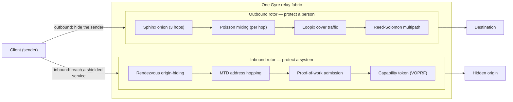

# Gyre

**A layered privacy-and-defense network fabric — one fabric, two rotors.**

[](https://github.com/rupeshbharambe24/Gyre/actions/workflows/ci.yml)
[](LICENSE)


Gyre is a single relay fabric that spins two ways at once: an **outbound
mixer** that dissolves a person into a crowd, and an **inbound shield** that
hides and protects a system. Tor is the proof-of-concept that one relay fabric
can host both — client anonymity *and* onion-service origin-hiding.

> [!WARNING]
> **Early research. Experimental. Unaudited.** Do **not** rely on Gyre for
> real anonymity or safety yet. It is being built in the open, milestone by
> milestone, and every claim is *measured* before it is trusted. The one
> hand-built cryptographic construction (the VOPRF capability token) is an
> unaudited prototype — treated as such wherever it appears.

---

## Contents

- [What it is (honestly)](#what-it-is-honestly)
- [Overview: one fabric, two rotors](#overview-one-fabric-two-rotors)
- [The two rotors](#the-two-rotors)
- [Quickstart](#quickstart)
- [Crate map](#crate-map)
- [The GATE: what the measurement actually says](#the-gate-what-the-measurement-actually-says)
- [Roadmap](#roadmap)
- [Documentation](#documentation)
- [Design principle](#design-principle)
- [Contributing](#contributing)
- [Security](#security)
- [License](#license)

---

## What it is (honestly)

Gyre is **not** a magic anonymity box, and it cannot beat physics. The
ceilings come first, on purpose:

- It **cannot beat a global passive observer at low latency.** Nobody can.
- It **cannot manufacture anonymity without a crowd** — anonymity *is* the size
  of the concurrent anonymity set.
- It **respects the anonymity trilemma:** strong anonymity, low latency, low
  overhead — pick about two.
- **Endpoint compromise deanonymises** regardless of the network. A login, a
  device, or a fingerprint undoes everything upstream of it.

What it *can* be is a **well-integrated** fabric built from audited, known-good
primitives, tuned for a **named adversary** — a *partial* network observer that
sees some links and correlates by timing, plus a censoring ISP and Sybil relay
operators — with one thing no anonymity network offers alongside a
competitive-by-design outbound rotor (the crowd is still the binding constraint):
an **inbound server-protection rotor**. See
[`docs/DESIGN.md`](docs/DESIGN.md) for the full picture and the honest ceilings.

**Threat model in one line:** the primary target is a partial observer; a
censoring ISP (obfuscation) and Sybil operators (PoW / stake / reputation) are
in scope; the global passive observer at low latency is explicitly *out* of
scope; an endpoint attacker is mitigated, never fully solved.

---

## Overview: one fabric, two rotors

One set of relays, two directions of protection. The **outbound** path protects
a *person* by dissolving them into a crowd; the **inbound** path protects a
*system* by hiding its origin behind the same fabric.



---

## The two rotors

### Outbound — protect a person

Dissolves a sender into the concurrent crowd. No single relay ever sees both
ends of a flow.

- **Sphinx onion routing (3 hops)** over the audited `sphinx-packet` format —
  each hop peels one layer, learns only the next hop, never the whole path.
- **Per-hop Poisson mixing** — every relay holds a packet for an independent
  exponential delay, so packets can leave in a different order than they arrived.
- **Loopix cover traffic** — clients emit cover "loops" that are byte-for-byte
  indistinguishable on the wire from real traffic.
- **Reed–Solomon erasure-coded multipath** — a message is split `m`-of-`k` and
  the fragments travel disjoint paths; any `m` reassemble it. Honest framing
  (**D7**): this hardens the *middle path* against a partial observer — it is
  **not** a reconstruction-threshold guarantee, and endpoints stay exposed.
- **Adaptive FAST / MIX lanes** — a per-flow dial: FAST is onion-only (near-zero
  added delay, Tor-class latency); MIX pays the Poisson delay for stronger timing
  resistance. Honest ceiling (**D8 / D21**): a partial observer can still separate
  the lanes by their delay distribution, so FAST and MIX partition the anonymity
  set rather than sharing one crowd.

### Inbound — protect a system

Hides and gates a service's origin behind the fabric. The origin publishes **no
inbound address**.

- **Rendezvous origin-hiding** — the origin dials *out* to a rendezvous relay and
  waits behind a shared cookie; the relay splices it to a client presenting the
  same cookie, copying opaque bytes between them. The relay learns neither
  endpoint nor the end-to-end-encrypted content — a trust topology a reverse-proxy
  CDN structurally cannot offer.
- **Moving-target-defense (MTD) address hopping** — the public ingress is
  `HMAC(key, time_window)`, so an authorized client and the origin agree on it
  while a scanner cannot pre-target it. Honest ceiling (**D22**): MTD serves a
  *closed, authorized* client set, not the open web.
- **Proof-of-work admission** — difficulty scales with load; the server verifies
  in one hash. It re-prices attacker asymmetry but does nothing for L3/L4
  volumetric floods.
- **Unlinkable capability tokens** — a blind VOPRF (RFC 9497 shape) over
  ristretto: a client that paid once redeems a token to skip the PoW, and the
  issuer (which only ever saw a random *blinded* point) cannot link redemption to
  issuance. Single-use; double-spend rejected. Built on audited `curve25519-dalek`
  primitives — but **the construction itself is an unaudited prototype.**

---

## Quickstart

Requires a stable Rust toolchain (MSRV **1.85**). Everything below runs offline.

```bash
# Build the whole workspace
cargo build --workspace

# Gates (exactly what CI runs on every push / PR)
cargo test  --workspace
cargo fmt   --all -- --check
cargo clippy --workspace --all-targets -- -D warnings

# --- Runnable demos (each prints its mechanism + the honest ceiling) ---

# The GATE: partial-observer correlation sweep + multipath exposure
cargo run -p gyre-adversary

# Inbound rotor: MTD ingress hopping + PoW admission
cargo run -p gyre-shield

# FAST vs MIX lanes on the same route, timed
cargo run -p gyre-node

# k-anonymity admission governor + staking Sybil-pricing model
cargo run -p gyre-crowd

# Hardening demos
cargo run -p gyre-obfs        # pluggable transport + entropy meter
cargo run -p gyre-endpoint    # forward-secret ratchet + personas
cargo run -p gyre-directory   # threshold-signed consensus + attestation
cargo run -p gyre-pir         # 2-server IT-PIR directory retrieval
cargo run -p gyre-stego       # LSB steganography (situational)
```

> [!NOTE]
> Four crates are library-only and have **no demo binary**: `gyre-common`,
> `gyre-sphinx`, `gyre-fec`, `gyre-net`. Exercise them with
> `cargo test --workspace`.

---

## Crate map

Thirteen crates, 55 tests, all green.

| Crate | Purpose | Tests |
|---|---|:--:|
| `gyre-common` | Shared constants & types (`FlowClass`, `DEFAULT_HOPS = 3`) | 3 |
| `gyre-sphinx` | Typed wrapper over the audited Sphinx mix-packet format | 5 |
| `gyre-fec` | Reed–Solomon erasure coding: fragment a message, reassemble any `m` | 4 |
| `gyre-net` | Async transport, directory, relay server, mixing, cover traffic | 4 |
| `gyre-node` | Demo binary: spin up a testnet + integration tests (lanes, multipath) | 2 |
| `gyre-adversary` | **The GATE:** partial-observer timing-correlation harness + verdict | 4 |
| `gyre-shield` | Inbound rotor: MTD hopping, PoW admission, rendezvous, capability tokens | 11 |
| `gyre-obfs` | Pluggable-transport framework + transports + an entropy meter | 4 |
| `gyre-endpoint` | Endpoint hardening: forward-secret ratchet, personas, uniform fingerprint | 3 |
| `gyre-directory` | Threshold-signed consensus, equivocation detection, build attestation | 5 |
| `gyre-pir` | Private directory retrieval: 2-server IT-PIR (default is full download) | 3 |
| `gyre-stego` | Deniability: LSB steganography (situational; honest limits) | 4 |
| `gyre-crowd` | P4: k-anonymity admission governor + staking Sybil-pricing model | 3 |
| **Total** | | **55** |

---

## The GATE: what the measurement actually says

This is the go/no-go. A deterministic timing model runs a *partial observer*
correlation attack over many concurrent flows and measures accuracy against a
baseline. The numbers are quoted verbatim from the harness.

```text
 flows   window   mix/hop   accuracy   chance   note
   50    1000ms      0ms      1.00      0.02    baseline: no mixing (FAST lane)
   50    1000ms     50ms      0.11      0.02    MIX lane, healthy crowd
   50    1000ms    150ms      0.04      0.02    more mixing
    5    1000ms    150ms      0.44      0.20    same mixing, tiny crowd -> barely helps

multipath exposure — fraction of flows a partial observer (on 20% of paths) touches:
  single-path (k=1): 0.23
  multipath  (k=3): 0.56
```

The honest verdict this produces — and it matches the design analysis:

1. **Mixing works, and it is the real correlation-resistance lever.** With no
   mixing a timing observer links flows *perfectly* (1.00); with MIX-lane delay it
   collapses to near chance (0.04).
2. **But it is gated on the crowd.** The same mixing with only a handful of
   concurrent flows barely helps (0.44). Cleverness never manufactures anonymity —
   concurrent traffic does.
3. **Multipath does *not* buy partial-observer correlation resistance** — it
   *widens* exposure (0.23 → 0.56). It buys availability and content-splitting, per
   **D7**.

---

## Roadmap

**All phases complete.** Both rotors are done, end to end, with a measurement
GATE between claim and trust. The only deferred item is a transport swap with no
bearing on anonymity properties.

<details>
<summary><b>Full milestone task list</b> (P0 · GATE · inbound · P3 · P4 · S5)</summary>

### P0 — outbound data plane
- [x] **S0 — Sphinx onion echo.** Wrap a payload, process it hop-by-hop; no relay
  sees both ends, the exit recovers the exact payload.
- [x] **S1 — networked relays.** Each relay is an async server; an onion really
  travels client → relay → relay → exit → destination, resolving next hops through
  a directory. (Transport: length-prefixed frames over async TCP.)
- [x] **S2 — mixing + cover traffic.** Per-hop Poisson delay for reordering; Loopix
  cover loops indistinguishable on the wire from real traffic.
- [x] **S3 — erasure-coded multipath.** Reed–Solomon `m`-of-`k` fragments, each in
  its own onion on a disjoint path; reassemble from any `m` (**D7**).
- [x] **S4 — FAST / MIX adaptive lanes.** Per-flow latency/resistance dial, sealed
  in the onion (**D8 / D21**).

### GATE
- [x] **Adversary-emulation harness.** Partial-observer correlation sweep +
  multipath exposure. The go/no-go, measured honestly.

### Inbound rotor
- [x] **MTD address hopping** via `HMAC(key, window)` (**D22**).
- [x] **Proof-of-work admission** (load-scaled difficulty, one-hash verify).
- [x] **Rendezvous origin-hiding** (origin dials out; relay learns nothing).
- [x] **Unlinkable VOPRF capability tokens** (RFC 9497 shape; unaudited prototype).

### P3 — six orthogonal hardening additions (add by threat, not by default)
- [x] **1 · Obfuscation / pluggable transport** (`gyre-obfs`) — appearance only;
  zero anonymity effect. Entropy meter shows the honest ceiling.
- [x] **2 · Endpoint isolation + data minimization** (`gyre-endpoint`).
- [x] **3 · Anonymous credentials** — delivered *as* the VOPRF token in
  `gyre-shield`.
- [x] **4 · Decentralization + attestation** (`gyre-directory`) — detection, not
  prevention.
- [x] **5 · Deniability / steganography** (`gyre-stego`) — situational; LSB stego
  is trivially detectable.
- [x] **6 · PIR for directory lookups** (`gyre-pir`) — **default OFF**; the full
  signed download is leak-free and cheaper.

### P4 — crowd / incentive layer (the binding constraint)
- [x] **k-anonymity admission governor** — refuses to promise anonymity below a
  safe concurrent set size (admit / batch / refuse; it will not lie).
- [x] **Staking Sybil-pricing model** — prices a takeover (`stake_to_control`),
  penalizes stake-splitting via a self-bond premium. Trades Sybil resistance for
  wealth concentration; neither piece *makes* a crowd.

### Deferred
- [ ] **S5 — QUIC/MASQUE transport upgrade.** TCP length-prefixed frames work
  today; deferred as low-value / high-risk plumbing with no bearing on anonymity
  properties.

</details>

---

## Documentation

| Document | What's in it |
|---|---|
| [`docs/DESIGN.md`](docs/DESIGN.md) | The full design, the decisions log (D1–D22), and the honest ceilings |
| [`docs/ARCHITECTURE.md`](docs/ARCHITECTURE.md) | How the crates fit together and data flows through the fabric |
| [`docs/ROADMAP.md`](docs/ROADMAP.md) | Milestone history and what "complete" means for each phase |
| [`docs/GLOSSARY.md`](docs/GLOSSARY.md) | Terms of art: mixnet, Loopix, VOPRF, MTD, anonymity set, and friends |
| [`CONTRIBUTING.md`](CONTRIBUTING.md) | How to build, test, and propose changes |
| [`SECURITY.md`](SECURITY.md) | How to report a vulnerability (GitHub private advisories) |
| [`CODE_OF_CONDUCT.md`](CODE_OF_CONDUCT.md) | Community expectations |
| [`CHANGELOG.md`](CHANGELOG.md) | What changed, release by release |

---

## Design principle

> [!IMPORTANT]
> **Never roll your own crypto or transport (D11).** The risky parts are audited
> crates we integrate, not code we invent. Gyre's value is in *combining*
> known-good primitives well and *measuring* honestly.

Integrated known-good building blocks: `sphinx-packet 0.7.0` (Nym-audited
Sphinx), `x25519-dalek 3.0`, `curve25519-dalek 5`, `ed25519-dalek 3`,
`reed-solomon-erasure 6`, `hmac 0.13`, `sha2 0.11`, `zeroize 1`, `tokio 1`. The
lone exception is called out everywhere it appears: the VOPRF capability-token
construction is a hand-built **prototype** on `curve25519-dalek` primitives —
unaudited.

---

## Contributing

Contributions are welcome. Start with [`CONTRIBUTING.md`](CONTRIBUTING.md), and
please keep the project's first rule in view: **honesty over overclaim.** Every
new capability ships with its measured ceiling, not just its best case. Before
opening a pull request, make the three gates pass locally:

```bash
cargo test  --workspace
cargo fmt   --all -- --check
cargo clippy --workspace --all-targets -- -D warnings
```

Discussion and bug reports go through repo [Issues](https://github.com/rupeshbharambe24/Gyre/issues).
Maintainer: [@rupeshbharambe24](https://github.com/rupeshbharambe24).

## Security

Gyre is **unaudited** and must not be trusted for real-world anonymity yet.
If you find a vulnerability, please report it privately via GitHub's private
vulnerability reporting (Security Advisories) — see [`SECURITY.md`](SECURITY.md).
Do not open a public issue for a security report.

## License

[MIT](LICENSE) © 2026 rupeshbharambe24.
