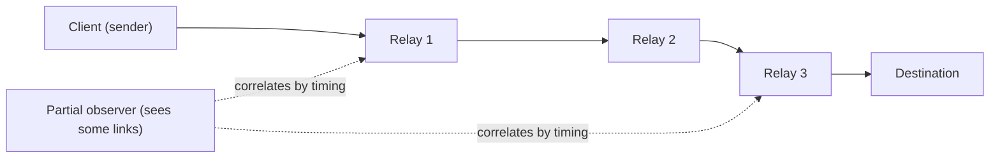

# Security Policy

This document is the most important one in the repository, because trust is the
only thing a privacy tool actually sells. So it is written to be **brutally
honest** rather than reassuring. Read the caution below before anything else.

> [!CAUTION]
> **Gyre is experimental, UNAUDITED research. Do not use it to protect real
> people or real systems today.**
>
> - No third party has audited this code, its protocols, or its assumptions.
>   Every property here is self-measured by the project's own harness.
> - The capability token's **construction** is now the audited `voprf` crate's RFC 9497
>   implementation, but the **integration around it** — key provenance, single-use,
>   rotation — is Gyre's own code and has had no cryptographic review. It replaced a
>   hand-rolled version whose unlinkability was found to be **entirely broken**; see
>   [`docs/AUDIT.md`](docs/AUDIT.md).
> - If your safety, freedom, or a production system depends on the outcome, use a
>   mature, audited tool (Tor, a reviewed mixnet, a real DDoS provider) instead.
>   Gyre is a research fabric for studying how these mechanisms compose, not
>   a shield you should hide behind yet.

---

## Contents

- [Supported versions](#supported-versions)
- [Reporting a vulnerability](#reporting-a-vulnerability)
- [Threat model and scope](#threat-model-and-scope)
- [Known honest limitations](#known-honest-limitations)
- [Full ceiling discussion](#full-ceiling-discussion)

---

## Supported versions

Gyre is **pre-1.0**. There are no stable releases, no long-term support
branches, and no backported security fixes. The only thing that receives fixes is
the current tip of `main`. If you are running anything older, the fix is to update.

| Version            | Supported          | Notes                                                   |
| ------------------ | ------------------ | ------------------------------------------------------- |
| `main` (latest)    | :white_check_mark: | The only supported target. Fixes land here.             |
| Any tagged release | :x:                | None exist yet; there is nothing to support.            |
| Any earlier commit | :x:                | Not supported. Update to latest `main`.                 |

> [!NOTE]
> Pre-1.0 means the API, the wire format, and the security assumptions can all
> change without notice. Do not pin your safety to a commit hash.

---

## Reporting a vulnerability

Please report suspected security issues **privately**.

> [!IMPORTANT]
> **Do not open a public GitHub issue for a security vulnerability.** A public
> issue discloses the problem to everyone, including anyone it could be used
> against, before there is a fix.

**Use GitHub's private vulnerability reporting** (Security Advisories) on the
repository:

1. Go to <https://github.com/rupeshbharambe24/Gyre>.
2. Open the **Security** tab → **Report a vulnerability** (GitHub Private
   Vulnerability Reporting).
3. Include: affected crate(s), the commit hash you tested, a description, and a
   reproduction (a failing test, a `cargo run -p <crate>` transcript, or a minimal
   snippet) wherever possible.

What to expect, stated plainly:

- **There is no security email address, and there is no bug-bounty program.** Do
  not look for one — it does not exist. The private advisory flow above is the
  only channel.
- This project is maintained by **one person** ([@rupeshbharambe24](https://github.com/rupeshbharambe24))
  in the open. Acknowledgement and fixes are **best-effort** and may be slow.
  There is no SLA, no on-call rotation, and no guarantee of a timeline.
- Because the whole codebase is already labelled unaudited and not-for-production,
  a report is a contribution to the research, not a disclosure against a system
  people depend on. That is the honest framing.

For non-security bugs, ordinary questions, and design discussion, a normal public
[GitHub issue](https://github.com/rupeshbharambe24/Gyre/issues) is the right
place.

---

## Threat model and scope

Gyre is a two-rotor fabric — an **outbound** mixer that dissolves a person
into a crowd, and an **inbound** shield that hides and protects a system. The
adversary it is *designed against* is deliberately narrow, and the things it does
**not** defend against are listed explicitly so researchers are not surprised.

### The named adversary (in scope)

The primary target is a **partial network observer**: an adversary who sees *some*
links of the network and tries to correlate flows by timing. Also in scope:

- A **censoring ISP or organization** — addressed by obfuscation / pluggable
  transports (`gyre-obfs`), on an appearance level only.
- **Sybil relay operators** — priced (never prevented) by a scarce resource:
  proof-of-work, stake, and reputation (`gyre-shield`, `gyre-crowd`).

The whole design accepts the **anonymity trilemma** — strong anonymity, low
latency, low overhead: pick about two — and chooses to target this partial
observer rather than pretend the ceiling does not exist.

### Explicitly OUT of scope

> [!WARNING]
> The following are **not** defended against. This is by design and by physics,
> not by omission. If your adversary is on this list, Gyre is the wrong tool.

- **The global passive observer at low latency.** An adversary who can watch
  *every* link simultaneously and correlate at low latency defeats this (and every
  other low-latency system). Nobody beats it at low latency — not us, not Tor.
  Loopix-style cover traffic resists it *only at mix latency*, never at the low
  latency of the FAST lane.
- **Endpoint compromise.** A stolen device, a malicious binary on the host, a
  logged-in session, or a browser/OS fingerprint deanonymizes the user regardless
  of anything the network does. `gyre-endpoint` *mitigates* this; it never solves
  it.
- **L3/L4 volumetric floods.** The inbound rotor's moving-target defense serves an
  **authorized client set** and is a trust-topology mechanism. It provides **no**
  volumetric DDoS scrubbing and cannot match anycast scrubbing capacity. (Decision
  D22.)
- **The crowd / adoption problem.** Anonymity *is* the size of the concurrent
  anonymity set. With a small crowd there is little anonymity to provide, and no
  amount of cleverness in the code manufactures a crowd that is not there. This is
  the hardest problem and it is a social/deployment problem, not a code one
  (Decisions D12, D20).

---

## Known honest limitations

These are not caveats hidden at the bottom — they are load-bearing facts about
what the mechanisms can and cannot do. Each corresponds to a standing
anti-overclaim rule the project treats as law.

- **Multipath widens exposure; it is not a reconstruction threshold.** Reed–Solomon
  erasure-coded multipath (`gyre-fec`) hardens the *middle path* probabilistically
  and buys availability and content-splitting. It does **not** require an attacker
  to collect *m* fragments to learn anything, and it does **not** hide the
  endpoints. Measured against a partial observer on 20% of paths, going from a
  single path to three paths *raised* the fraction of touched flows from **0.23 to
  0.56**. More paths means more surface, not more secrecy (Decision D7).
- **"Unblockable" is impossible and the word is banned here.** Obfuscation buys
  "more expensive to block than the censor will pay *today*" — nothing more.
  Worse, obfs4-style uniform-random bytes are now a *positive* entropy-DPI
  fingerprint, so the appearance layer can help a censor as easily as hinder one.
- **Staking and anonymous credentials add ZERO intrinsic Sybil resistance.** The
  only thing that prices Sybils is the scarce resource itself (proof-of-work or
  stake). Staking concentrates influence toward **wealth**; it is not
  user-decentralization and it is not a Sybil proof. Credentials
  (the VOPRF token) authorize access — they do not make identities scarce.
- **Reproducible builds prove `binary == source`, not what a relay runs.** Build
  attestation (`gyre-directory`) lets you verify that a published binary matches
  its source. It cannot prove that a given relay operator is actually *running*
  that binary rather than a modified one. Attestation is **detection, not
  prevention**.
- **PIR is information-theoretically secure only if the two servers do not
  collude.** The 2-server IT-PIR in `gyre-pir` is **off by default** — a full,
  threshold-signed directory download is already leak-free and cheaper. When PIR
  *is* used, its guarantee collapses entirely the moment the two servers collude
  (Decision D18).
- **The capability token is no longer our own cryptography — but the integration is still
  unreviewed.** The construction is now the audited [`voprf`](https://crates.io/crates/voprf)
  crate's RFC 9497 implementation. Getting there was not voluntary: a self-review found the
  previous hand-rolled version was labelled "verifiable" while carrying **no DLEQ proof**,
  which broke unlinkability outright — a malicious issuer could tag every client with a
  per-client key and link every redemption (reproduced: 5 of 5). That is exactly the class
  of flaw a real audit exists to find, and it was found by the author rather than an
  auditor. What remains Gyre's own code — key provenance, the spent set, rotation policy —
  has still had **no external review**.
- **Key provenance is now enforced, but rotation handling is not.** Clients pin the issuer
  key from threshold-verified consensus parameters (`VerifiedParams`), so a key the issuer
  supplied cannot reach the verification path by accident. What is *not* handled: a client
  holding a stale consensus during key rotation simply fails to verify tokens from the new
  epoch. See open question Q-C in [`docs/AUDIT.md`](docs/AUDIT.md).
- **Cover traffic is not concurrent real senders.** A cover-inflated "effective
  set" must never be read as the number of real people actually present. The
  anonymity that counts is the concurrent *real* crowd, and it is always the
  binding constraint.

---

## Full ceiling discussion

For the complete, decision-by-decision treatment of these ceilings — the GATE
measurements, the trilemma reasoning, and the full decisions log (D1–D22) — see
[docs/DESIGN.md](docs/DESIGN.md).
