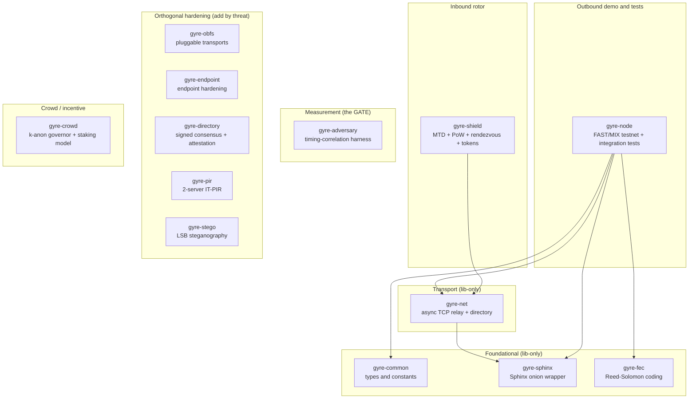
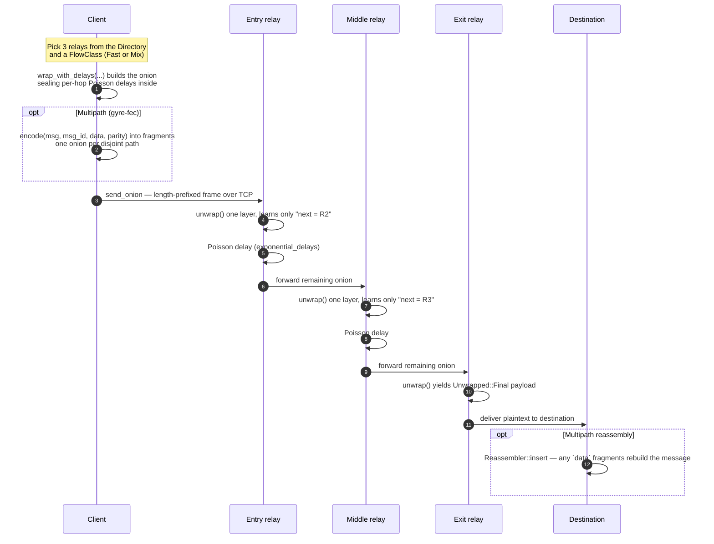
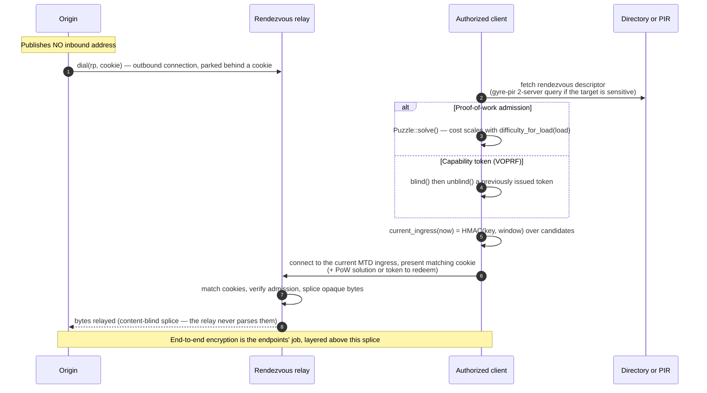

# Gyre — Architecture

[](https://github.com/rupeshbharambe24/Gyre/actions/workflows/ci.yml)


This document describes **how the code is organized** — the workspace, the crate
dependency graph, and the path a packet actually travels. It is the structural
companion to [`DESIGN.md`](DESIGN.md), which explains **why** the design is shaped
the way it is. For the project overview and quickstart, see [`../README.md`](../README.md).

> [!IMPORTANT]
> Gyre is **early research, experimental, and unaudited**. Do not rely on it
> for real anonymity or safety yet. Every architectural claim below is bounded by a
> physics ceiling stated in-line — mixing needs a crowd, no low-latency design beats
> a global passive observer, and an endpoint compromise deanonymises regardless of
> the network. Those limits are not footnotes; they are the design.

---

## Table of contents

- [1. Overview — one fabric, two rotors, 14 crates](#1-overview--one-fabric-two-rotors-14-crates)
- [2. Life of an outbound packet](#2-life-of-an-outbound-packet)
- [3. Life of an inbound connection](#3-life-of-an-inbound-connection)
- [4. Crate-by-crate reference](#4-crate-by-crate-reference)
- [5. Transport note](#5-transport-note)
- [6. Where the honesty lives](#6-where-the-honesty-lives)

---

## 1. Overview — one fabric, two rotors, 14 crates

Gyre is one relay fabric hosting **two rotors** that point in opposite
directions:

- **Outbound rotor** — dissolves a *person* into a crowd (Sphinx onion routing,
  per-hop Poisson mixing, cover traffic, erasure-coded multipath, FAST/MIX lanes).
- **Inbound rotor** — hides and gates a *system* (rendezvous origin-hiding,
  moving-target-defense ingress hopping, proof-of-work admission, capability tokens).

The workspace is a Cargo workspace of **15 crates, 171 tests, all green** (edition
2021, MSRV `rust-version = 1.85`, MIT). Crates fall into layers by role:

| Layer | Crates | Tests |
|---|---|---|
| Foundational (lib-only) | `gyre-common`, `gyre-sphinx`, `gyre-fec` | 3 · 11 · 9 |
| Transport (lib-only) | `gyre-net` | 14 |
| Outbound demo & tests | `gyre-node` | 2 |
| Measurement — the GATE | `gyre-adversary` | 4 |
| Inbound rotor | `gyre-shield` | 42 |
| Orthogonal hardening | `gyre-obfs`, `gyre-endpoint`, `gyre-directory`, `gyre-pir`, `gyre-stego` | 9 · 8 · 10 · 6 · 10 |
| Crowd / incentive | `gyre-crowd` | 8 |
| Simulation / measurement | `gyre-sim` | 19 |
| Standalone binaries | `gyre-cli` | 4 |

### Dependency graph

Arrows point **from a crate to the workspace crate it depends on**. Only three
crates have intra-workspace edges (`gyre-net`, `gyre-node`, `gyre-shield`);
everything else depends solely on audited third-party crates and stands alone. That
is deliberate — the hardening additions, the measurement gate, and the crowd model
are **an orthogonal matrix, not a stack** (design decision **D10**), so each can be
added by threat rather than pulled in by default.



> [!NOTE]
> `gyre-adversary` and `gyre-crowd` have **no dependencies at all** — not even
> workspace ones. The gate is a self-contained deterministic model so its numbers
> can be trusted and regression-tested; the crowd crate is pure policy math. Neither
> touches the data plane.

---

## 2. Life of an outbound packet

A client wraps its payload in a Sphinx onion, each relay peels exactly one layer and
applies its own Poisson delay, and the exit hands cleartext to the destination.
Optionally the payload is Reed–Solomon–fragmented across disjoint paths first.



Honest ceilings, in-line where they belong:

- **3 hops, capped on purpose** (**D5**): `DEFAULT_HOPS = 3`. Beyond that the
  anonymity gain is negligible for real latency, and the bad-relay probability rises.
- **Mixing is the correlation-resistance lever** (**D8**): the per-hop Poisson delay
  sealed inside the onion is what degrades a timing observer — but only in proportion
  to how bunched the traffic is. The GATE measured the FAST lane at correlation
  accuracy `1.00` (no mixing) dropping toward chance under mixing — *in a healthy
  crowd*. In a tiny crowd it barely helps.
- **Multipath widens exposure, it does not resist a partial observer** (**D7**):
  splitting across disjoint paths buys availability and content-splitting, but a
  partial observer *touches more flows*, not fewer (the GATE measured single-path
  reach `0.23` rising to `0.56` at k=3). Fragmentation is *probabilistic
  middle-path hardening*, **not** a reconstruction-threshold guarantee — the
  endpoints stay correlation points.
- **Lanes partition the crowd** (**D21**): FAST and MIX are separable by their
  observable delay distribution, so they split the anonymity set rather than sharing
  one crowd. FAST does **not** resist a global passive observer at low latency; no
  low-latency design does.

---

## 3. Life of an inbound connection

The origin never publishes a reachable address. It dials **out** to a rendezvous
relay behind a cookie; the client finds the moving ingress by computing
`HMAC(key, window)`, pays admission (a PoW puzzle or an unlinkable capability token),
and the relay splices opaque bytes between the two — never seeing plaintext.



Honest ceilings:

- **The rendezvous relay is content-blind, but Gyre does not yet supply the
  end-to-end encryption.** `rendezvous::dial` / `copy_bidirectional` splice *opaque*
  bytes — the relay never parses them — but an end-to-end tunnel (TLS/Noise
  terminating only at the origin) is the endpoints' responsibility and is **not**
  part of the current demo, which splices cleartext. The relay's blindness is
  structural; the confidentiality of what flows through it is not yet built here.

- **Serves a closed / authorized client set** (**D22**): MTD ingress derivation needs
  a client-held `key`, so scanners without it cannot pre-target a stable address — but
  arbitrary open-web clients cannot either. This is a trust-topology win for
  authenticated tunnels, **not** open-web DDoS scrubbing; there is **no L3/L4
  volumetric defence** here, and a flood that saturates the link wins before any
  puzzle is evaluated.
- **PoW re-prices, it does not beat a resourced adversary**: a botnet or ASIC farm
  outcomputes mobile clients; `difficulty_for_load` only raises the asymmetry.
- **Tokens are an unaudited prototype**: the capability token in `gyre-shield::token`
  is a hand-assembled VOPRF (RFC 9497 shape) on `curve25519-dalek` primitives. The
  primitives are audited; the *construction* is not. Its unlinkability must be reviewed
  before anyone relies on it.

---

## 4. Crate-by-crate reference

API names below match the source under
[`../crates`](../crates); each crate's `lib.rs` doc-comment is the authoritative
description.

| Crate | Key public types / fns | Responsibility |
|---|---|---|
| `gyre-common` | `DEFAULT_HOPS`, `FlowClass::{Fast, Mix}`, `FlowClass::default_mean_hop_delay` | Dependency-free shared constants and the per-flow service-level enum sealed inside the onion. |
| `gyre-sphinx` | `Relay` (`new`, `process`), `wrap`, `wrap_with_delays`, `unwrap`, `Unwrapped`, `exponential_delays`, `packet_to_bytes` / `packet_from_bytes`, re-exports `Node`, `Delay` | Ergonomic, typed wrapper over the audited `sphinx-packet` format — no relay learns both ends. Does **not** roll its own crypto (**D11**). |
| `gyre-fec` | `Fragment`, `encode(msg, msg_id, data, parity)`, `Reassembler` (`insert`) | Reed–Solomon `m`-of-`k` erasure coding: fragment a message, reassemble from any `data` shards. |
| `gyre-net` | `RelayServer` (`new`, `verbose`, `serve`), `Directory` (`from_entries`, `lookup`), `send_onion`, `emit_loops`, `write_frame` / `read_frame`, `MAX_FRAME` | Async TCP transport, in-memory directory, relay server, per-hop mixing and Loopix cover-loop emission. |
| `gyre-node` | binary `gyre-node`; integration tests `lanes`, `multipath` | Demo: spins up a local testnet and times a FAST vs MIX flow on the same route; houses the lanes and multipath integration tests. |
| `gyre-adversary` | `Scenario`, `Correlation`, `timing_correlation`, `timing_correlation_avg`, `partial_observer_reach`, `Rng` | **The GATE.** A deterministic partial-observer timing model that measures correlation vs a baseline and the multipath exposure trade-off, then issues a verdict. |
| `gyre-shield` | `IngressSchedule` (`current_ingress`, `ingress_at`), `Puzzle` (`solve`, `verify`), `Solution`, `difficulty_for_load`, `leading_zero_bits`; `rendezvous::{RendezvousRelay, dial, Cookie}`; `token::{Issuer, blind, unblind, Token}` | The inbound rotor: MTD ingress hopping via `HMAC(key, window)`, load-scaled PoW admission, cookie-based rendezvous splicing, and blind VOPRF capability tokens. |
| `gyre-obfs` | `Obfuscator` trait, `Identity`, `Polymorphic`, `TlsMimic`, `shannon_entropy_bits_per_byte`, `default_transports` | Pluggable-transport framework that reshapes first-hop wire *appearance*, plus an entropy meter. Zero anonymity effect. |
| `gyre-endpoint` | `Ratchet` (`next_message_key`), `Persona` / `Identity` (`persona`, `key`), `uniform_fingerprint`, `UNIFORM_FINGERPRINT`, `naive_fingerprint` | Endpoint hardening: forward-secret hash ratchet, compartmentalized personas, one uniform client fingerprint. Keys wiped via `zeroize`. |
| `gyre-directory` | `Authority` (`generate`, `sign`), `Consensus`, `accept_consensus`, `detect_equivocation`, `build_is_blessed` | `t`-of-`n` ed25519-signed consensus, Certificate-Transparency-style equivocation detection, reproducible-build attestation. |
| `gyre-pir` | `Directory` (`download_all`, `answer`), `build_queries`, `recover` | 2-server information-theoretic (XOR) PIR for the one lookup whose target leaks — the rendezvous descriptor. Default is `download_all`. |
| `gyre-stego` | `embed`, `extract`, `capacity_bytes` | LSB steganography for deniability. Situational; one bit per cover byte. |
| `gyre-crowd` | `Governor` (`decide`), `Admission::{Admit, Batch, Refuse}`, `stake_to_control`, `reward_with_self_bond_premium` | P4 policy math: a k-anonymity admission governor that refuses to over-promise, and a staking Sybil-pricing model. |

<details>
<summary>Runnable demos (crates with a <code>main.rs</code>)</summary>

```bash
cargo run -p gyre-adversary   # the GATE report: correlation sweep + multipath exposure
cargo run -p gyre-shield      # MTD ingress hopping + PoW admission
cargo run -p gyre-node        # FAST vs MIX lanes on the same route, timed
cargo run -p gyre-crowd       # k-anon admission governor + staking Sybil-pricing
cargo run -p gyre-obfs        # pluggable transports + entropy meter (+ honest ceiling)
cargo run -p gyre-endpoint    # ratchet + personas + uniform fingerprint
cargo run -p gyre-directory   # threshold-signed consensus + equivocation + attestation
cargo run -p gyre-pir         # 2-server IT-PIR vs full download
cargo run -p gyre-stego       # LSB embed/extract + honest limits
```

Lib-only crates (no demo binary): `gyre-common`, `gyre-sphinx`, `gyre-fec`, `gyre-net`.

</details>

---

## 5. Transport note

The wire substrate today is **length-prefixed frames over async TCP** (a `u32`
big-endian length followed by that many bytes, capped by `MAX_FRAME`), served by
`gyre-net::RelayServer` on `tokio`. It is the smallest thing that is genuinely
networked, chosen so that mixing and multipath could be built on a real async
substrate.

> [!NOTE]
> The **QUIC/MASQUE transport swap (milestone S5) is deferred** — it is the *only*
> deferred item in the roadmap. Per-circuit streams and censorship-resistant framing
> are worthwhile plumbing, but they are low-value / high-risk to swap now and have
> **no bearing on the anonymity properties**, which live in the onion and the mixing.
> `gyre-net` is written against a small surface precisely so that swap stays
> contained. See [`ROADMAP.md`](ROADMAP.md).

---

## 6. Where the honesty lives

This project's identity is refusing to overclaim, and that refusal is enforced in the
code, not just the docs: **the top doc-comment of every crate's `lib.rs` states that
crate's ceiling.** Read the source and the limit is the first thing you see.

> [!WARNING]
> These four ceilings are permanent invariants, not open work items:
>
> - Nothing here beats a **global passive observer** at low latency — stated openly.
> - Anonymity **is** the size of the concurrent crowd; cleverness never manufactures one.
> - The anonymity **trilemma** holds: strong anonymity, low latency, low overhead — pick ~two.
> - An **endpoint** compromise deanonymises regardless of the network.

| Crate | The ceiling its `lib.rs` documents |
|---|---|
| `gyre-common` | FAST/MIX are separable by observable delay, so lanes *partition* the anonymity set rather than sharing one crowd (**D8**/**D21**). |
| `gyre-sphinx` | Does not implement Sphinx — wraps the audited `sphinx-packet` crate (**D11**). 3 hops is a deliberate cap (**D5**). |
| `gyre-fec` | Probabilistic middle-path hardening vs a *partial* observer — **not** a reconstruction threshold; multipath *widens* endpoint exposure (**D7**). |
| `gyre-net` | TCP length-prefixed frames today; the directory is an in-memory testnet map; QUIC/MASQUE is a later, contained swap. |
| `gyre-node` | Demo and integration tests only — it routes packets to *measure* the fabric, it is not a deployment. |
| `gyre-adversary` | A deterministic timing *model*, not real packets, and its greedy single-message attacker **understates** a real one — so its numbers are optimistic. `gyre-sim` supersedes them for any anonymity claim. |
| `gyre-sim` | A *simulation*, not a deployment: real protocol code over a modelled network, with no TCP, cross-traffic, or queueing. Measures the mechanism against a named adversary; proves nothing about the open internet. |
| `gyre-shield` | MTD serves a **closed/authorized** client set; PoW re-prices but does not beat a resourced adversary; **no L3/L4 volumetric defence** (**D22**); the VOPRF token is an **unaudited** prototype. |
| `gyre-obfs` | Appearance only — **zero** anonymity effect; "unblockable" is false; `Polymorphic` uniform output is a *positive* entropy-DPI fingerprint. |
| `gyre-endpoint` | Isolation *contains* a compromise; it cannot make an untrusted endpoint trusted. Forward secrecy protects *past* sessions, not an *active* keylogger; uniformity needs a real crowd. |
| `gyre-directory` | **Detection, not prevention.** Reproducible builds prove *binary == source*, **not** that a relay runs that binary. Control-plane only — zero anonymity effect. |
| `gyre-pir` | Information-theoretic **only if the two servers don't collude** — and Sybil infrastructure is in-scope. Default **off**; full download is leak-free and cheaper. |
| `gyre-stego` | LSB embedding is *trivially detectable*; capacity is one bit per cover byte; at-rest hidden volumes are de-recommended entirely. |
| `gyre-crowd` | Neither the governor nor staking **creates** a crowd; staking converts Sybil resistance into wealth concentration — stake-decentralization is not user-decentralization. |

---

<sub>See also: [`DESIGN.md`](DESIGN.md) (the *why*, with decisions D1–D22) · [`ROADMAP.md`](ROADMAP.md) · [`GLOSSARY.md`](GLOSSARY.md) · [`../README.md`](../README.md) · [`../SECURITY.md`](../SECURITY.md) · [`../CONTRIBUTING.md`](../CONTRIBUTING.md) · [`../LICENSE`](../LICENSE). Maintainer: [@rupeshbharambe24](https://github.com/rupeshbharambe24).</sub>
