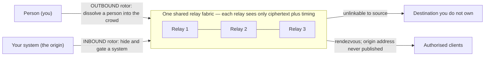
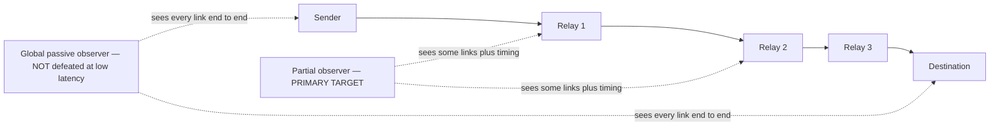

# Gyre — Design

A condensed, public design summary. It states what the system is, the adversary
it targets, the mechanisms it uses, and — just as importantly — the limits it
does not cross.

> [!WARNING]
> Gyre is **early research: experimental and UNAUDITED**. Do **not** rely on
> it for real anonymity or safety yet. It is built in the open, milestone by
> milestone, and every claim is *measured before it is trusted*. Nothing here beats
> a global passive observer at low latency — nobody's design can (see
> [§3, The physics ceiling](#3-the-physics-ceiling)).

## Table of contents

- [1. Two rotors, one fabric](#1-two-rotors-one-fabric)
- [2. Threat model (named up front)](#2-threat-model-named-up-front)
- [3. The physics ceiling](#3-the-physics-ceiling)
- [4. Outbound rotor — mechanisms](#4-outbound-rotor--mechanisms)
- [5. Inbound rotor — mechanisms](#5-inbound-rotor--mechanisms)
- [6. Orthogonal hardening (added by threat, not by default)](#6-orthogonal-hardening-added-by-threat-not-by-default)
- [7. What we can and cannot claim](#7-what-we-can-and-cannot-claim)
- [8. Build order (measurement-gated)](#8-build-order-measurement-gated)
- [9. Tech stack (never roll your own)](#9-tech-stack-never-roll-your-own)
- [Appendix A — Decisions log (D1-D22)](#appendix-a--decisions-log-d1-d22)
- [Appendix B — Standing anti-overclaim rules](#appendix-b--standing-anti-overclaim-rules)

## 1. Two rotors, one fabric

The two goals point in opposite directions and need different rules, so they are
two rotors sharing one relay fabric (Tor already proves this is possible: client
anonymity plus onion-service origin-hiding).

- **Outbound — protect a person.** Traffic leaves you toward services you don't
  own, watched by a powerful observer. Goal: unlinkability of *you ↔ destination*.
- **Inbound — protect a system.** Traffic arrives toward an asset you own. Goal:
  hide the origin, gate access, shrink the attack surface.

Both rotors ride the same relays; no single relay ever learns both ends of a
flow. The outbound rotor is a **mixer** (dissolve a sender into a crowd); the
inbound rotor is a **shield** (hide and protect an origin). See decisions
[D1](#appendix-a--decisions-log-d1-d22) and [D2](#appendix-a--decisions-log-d1-d22).

## 2. Threat model (named up front)

Everything is measured against these. We do **not** claim to beat a global
passive observer at low latency — nobody can.

| Adversary | In scope? |
|---|---|
| Partial network observer (sees some links, correlates by timing) | **Primary target** |
| Censoring ISP / organisation | Yes (obfuscation) |
| Sybil relay operators | Yes (staking / PoW / reputation) |
| Global passive observer | **Out of scope at low latency** (stated openly) |
| Endpoint attacker (has your device) | Mitigated, never fully solved |

The trust boundary below shows the split we design around: a **partial observer**
sees *some* links and correlates by timing — which per-hop mixing defeats *when
the crowd is real* — while a **global observer** sees *every* link and wins by
end-to-end correlation regardless of what we do at low latency.

> [!NOTE]
> **Scope.** The partial observer is the *named target* we build and measure
> against. The censoring ISP and Sybil relay operator are in scope through
> obfuscation and PoW/stake/reputation respectively. The **global passive
> observer is deliberately out of scope at low latency**, and the **endpoint
> attacker** — someone holding your device, a login, or a fingerprint — is
> mitigated but never fully solved. These boundaries are stated up front, not
> buried.

## 3. The physics ceiling

> [!WARNING]
> These limits are not implementation gaps we plan to close — they are physics.
> No amount of cleverness in this codebase moves them.

1. **Anonymity trilemma** — strong anonymity, low latency, low overhead: pick ~two.
2. **Global observer** — beats any low-latency design by end-to-end correlation.
3. **Endpoint & crowd** — a login or fingerprint deanonymises you regardless of the
   network, and anonymity is bounded by the number of *concurrent* users.

Anonymity **is** the size of the concurrent anonymity set: cleverness never
manufactures a crowd (decisions [D3](#appendix-a--decisions-log-d1-d22),
[D4](#appendix-a--decisions-log-d1-d22), [D12](#appendix-a--decisions-log-d1-d22)).

## 4. Outbound rotor — mechanisms

- **Onion routing** (Sphinx, 3 hops): no relay learns both ends. Capped at 3 on
  purpose — more hops buy negligible anonymity for real latency
  ([D5](#appendix-a--decisions-log-d1-d22)).
- **Mixing** (per-hop Poisson delay) + **cover traffic** (Loopix loops): breaks
  timing correlation, at an honest latency cost ([D6](#appendix-a--decisions-log-d1-d22)).
  Loopix's global-observer resistance holds **only at mix latency, never low
  latency**.
- **Erasure-coded multipath** (Reed–Solomon `m`-of-`k` across disjoint paths):
  *probabilistic middle-path hardening* against a partial observer. **Not** a
  reconstruction-threshold guarantee — endpoints remain correlation points
  ([D7](#appendix-a--decisions-log-d1-d22)).
- **Adaptive FAST/MIX lanes**: the flow class is sealed inside the onion. FAST is
  onion-only (Tor-class latency); MIX pays latency for stronger resistance. This
  is an honest menu of trilemma points, not a way around it
  ([D8](#appendix-a--decisions-log-d1-d22)).

## 5. Inbound rotor — mechanisms

- **Rendezvous**: the origin publishes no routable address; clients meet it at a
  relay that only ever sees ciphertext, and TLS/Noise terminates *only at the
  origin* — no intermediary holds plaintext.
- **Moving-target-defense** address hopping via `HMAC(key, time_window)`: the
  reachable surface moves; authorised clients follow it, scanners can't. (Serves a
  closed/authorised client set — not arbitrary open-web clients.)
- **Proof-of-work admission** that scales with load: prices out floods.
- **Unlinkable capability tokens**: fast-path trusted clients without identity.
  The token construction is a hand-built **prototype** (RFC 9497-shaped VOPRF on
  `curve25519-dalek` primitives) and is **UNAUDITED**.

Honest limit: this hides the origin and prices admission, but offers **no L3/L4
volumetric defence** and depends on a healthy relay crowd (decisions
[D9](#appendix-a--decisions-log-d1-d22), [D22](#appendix-a--decisions-log-d1-d22)).

## 6. Orthogonal hardening (added by threat, not by default)

Each covers a distinct dimension an adversary can observe; add one only when your
adversary attacks that dimension. Combine them as a **matrix, not a stack**
([D10](#appendix-a--decisions-log-d1-d22)).

1. **Obfuscation / pluggable transport** — make the first hop look like nothing or
   ordinary HTTPS. It changes how traffic *looks*, not who is linkable — **zero
   anonymity effect**. "Unblockable" is impossible; this only raises the censor's
   cost. (obfs4-style random bytes are now themselves a positive entropy-DPI fingerprint.)
2. **Endpoint isolation + data minimisation** — compartmentalised identities,
   ephemeral keys, one uniform client fingerprint (which feeds the crowd).
3. **Anonymous credentials** — prove "authorised" with zero identity. These add
   *zero* intrinsic Sybil resistance; the scarce resource (PoW/stake) does.
4. **Decentralisation + attestation** — threshold-signed directory + reproducible
   builds; moves trust to many parties whose cheating is publicly detectable.
   (Reproducible builds prove binary==source, **not** that a relay runs that binary.)
5. **Deniability / steganography** — situational: hide *that* you use it at all.
   LSB steganography is trivially detectable; use it only where that trade holds.
6. **PIR for directory lookups** — hide *which* relay/service record you fetch.
   **Default OFF**: downloading the full signed directory is cheaper and leak-free at
   this scale, so PIR is reserved for the one lookup whose target genuinely leaks (the
   inbound rendezvous descriptor), and even then only if the two servers don't collude.

## 7. What we can and cannot claim

- vs **VPN**: stronger on trust/anonymity (no single operator sees both ends);
  slower — a VPN wins on latency and simplicity.
- vs **Tor**: an honest mixing dial and modern transport let us *compete* on
  latency; Tor's decisive advantage is its crowd. We do not surpass it.
- vs **Nym**: we add an inbound rotor it doesn't have; on outbound mixnet
  anonymity Nym wins on a live crowd, incentives, and audits.
- vs **Cloudflare** (inbound): a trust-topology win for authenticated tunnels; we
  cannot match anycast scrubbing capacity.

The binding constraint everywhere is the same — **crowd**. Cleverness never
manufactures anonymity or beats a global observer, and this project is careful to
keep saying so (decisions [D19](#appendix-a--decisions-log-d1-d22),
[D20](#appendix-a--decisions-log-d1-d22),
[D21](#appendix-a--decisions-log-d1-d22)).

## 8. Build order (measurement-gated)

`P0 core (Sphinx → mixing → multipath → lanes)` → **gate: measure correlation vs
latency against a baseline** → `P2 transport + inbound wedge` → `P3 the six
hardening additions` → `P4 scale + crowd`. Ship nothing to real users until the
core is measured, the crypto is externally audited, and a real crowd-bootstrap
plan exists.

## 9. Tech stack (never roll your own)

Rust; **Sphinx** (`sphinx-packet`) + **Noise**/**WireGuard** + **QUIC/MASQUE**;
**reed-solomon-erasure**; Loopix-style mixing; `x25519-dalek` / `libsodium`.
Hardening uses obfs4/uTLS/Snowflake, libsignal, Privacy-Pass/RLN, threshold-BLS +
reproducible builds, and PIR only where it earns its cost. Testing uses Shadow,
container/netns devnets, and a custom adversary-emulation harness. We integrate
audited, known-good crates and do not build crypto or transport from scratch
([D11](#appendix-a--decisions-log-d1-d22)).

> [!NOTE]
> This is the *target* stack. **Transport today is length-prefixed frames over async
> TCP**; the **QUIC/MASQUE swap (S5) is the single deferred item** — low-value,
> high-risk plumbing with no bearing on the anonymity properties (see
> [ROADMAP.md](ROADMAP.md)). Noise/WireGuard, Snowflake, libsignal, threshold-BLS and
> Shadow are named as the direction of travel, not as things wired in today.

---

## Appendix A — Decisions log (D1-D22)

The load-bearing design decisions, referenced by number throughout this document.

| ID | Decision |
|---|---|
| **D1** | Two rotors, not one box. |
| **D2** | Rotation = defense, not anonymity. |
| **D3** | Anonymity = unlinkability + crowd. |
| **D4** | Respect the trilemma; target a partial observer. |
| **D5** | Onion capped at 3 hops. |
| **D6** | Mixing + shared cover traffic. |
| **D7** | Erasure multipath = probabilistic MIDDLE-PATH hardening vs a partial observer, NOT a reconstruction threshold (endpoints stay exposed). |
| **D8** | Adaptive per-flow mixing = the perf lever (sealed in the onion). |
| **D9** | Inbound = rendezvous + MTD + PoW + tokens. |
| **D10** | Combine orthogonally (a matrix, not a stack). |
| **D11** | Do not build crypto/transport from scratch. |
| **D12** | The crowd is the hardest problem. |
| **D13** | Obfuscation / pluggable transport. |
| **D14** | Endpoint isolation + data minimization. |
| **D15** | Anonymous credentials. |
| **D16** | Decentralization + attestation (detection, not prevention). |
| **D17** | Deniability / steganography (situational). |
| **D18** | PIR surgical, default OFF. |
| **D19** | Position as INTEGRATION, not a record-holder. |
| **D20** | Crowd bootstrap is the critical path, not crypto. |
| **D21** | Speed = FAST/MIX lanes + QUIC/MASQUE + AS-aware paths (match / modest-win vs modern Tor, not "beat"). |
| **D22** | Cloudflare-compete = trust topology for closed/enterprise tunnels; MTD serves an AUTHORIZED client set; NO L3/L4 volumetric defense. |

## Appendix B — Standing anti-overclaim rules

**Project law.** Any document that violates one of these rules is *wrong*. They
are reproduced here verbatim.

1. Never say "beat Tor on speed" unqualified — say "match / modest win vs modern Tor."
2. Never sum inbound-protected clients into the outbound anonymity-set number.
3. Never quote a cover-inflated "effective set" as if it were concurrent real senders.
4. Loopix global-observer resistance holds ONLY at mix latency, never low latency.
5. Multipath = probabilistic middle-path hardening, NOT a reconstruction threshold.
6. "Unblockable" is BANNED — obfuscation buys "more expensive to block than the censor will pay today"; obfs4-style random bytes are now a POSITIVE entropy-DPI fingerprint.
7. Anonymous credentials / staking add ZERO intrinsic Sybil resistance — the scarce resource (PoW/stake) does; staking = wealth concentration, NOT user-decentralization.
8. Reproducible builds prove binary==source, NOT that a relay runs that binary.

---

Gyre is MIT-licensed ([../LICENSE](../LICENSE)) and experimental. Start
at the [project README](../README.md). Report issues via the repo's GitHub Issues;
report vulnerabilities privately via GitHub Security Advisories. Maintainer:
[@rupeshbharambe24](https://github.com/rupeshbharambe24).
