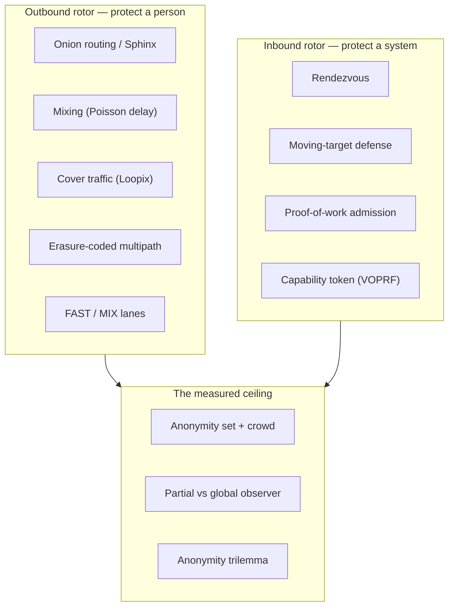

# Gyre — Glossary

Plain-English definitions of the privacy and networking terms used across the
Gyre docs. Each entry keeps the honest ceiling next to the concept, not
buried — that is the whole point of this project. Where a term maps to code, an
_in Gyre_ note points at the crate that implements it.

> [!NOTE]
> Gyre is early-stage, **experimental, and unaudited**. These definitions
> describe design intent and measured prototypes — not a system to rely on for
> real anonymity or safety yet. See [DESIGN.md](DESIGN.md) for the architecture.

> [!IMPORTANT]
> The binding constraint everywhere in this glossary is the same one: the
> **crowd**. Cleverness never manufactures anonymity, and nothing here beats a
> global passive observer at low latency. If a definition seems to promise more,
> re-read it — it doesn't.

## Where the terms live

The two rotors share one relay fabric. This map orients the vocabulary before you
read the definitions.

## Jump to a letter

[A](#a) · [C](#c) · [D](#d) · [E](#e) · [F](#f) · [G](#g) · [K](#k) · [M](#m) · [O](#o) · [P](#p) · [R](#r) · [S](#s) · [T](#t) · [U](#u) · [V](#v)

---

## A

- **Anonymity set** — The group of users you are indistinguishable from at a given
  moment. Your anonymity is literally the *size* of this set: hide in ten people
  and an observer has a 1-in-10 guess; hide in ten thousand and it's 1-in-10,000.
  No amount of protocol design creates an anonymity set — only concurrent real
  users do.
  - _In Gyre:_ measured directly by the adversary harness (`gyre-adversary`);
    the tiny-crowd result — correlation accuracy **0.44** with only 5 flows (chance
    0.20) versus **0.04** with 50 flows (chance 0.02), the *same* mixing both times —
    is the proof that the set, not the mechanism, is decisive.

- **Anonymity trilemma** — A design cannot simultaneously maximize all three of:
  strong anonymity, low latency, and low bandwidth/overhead. You get to pick about
  two. Any honest system states which corner it sacrifices for a given mode.
  - _In Gyre:_ made explicit as a dial, not hidden — the `FlowClass` enum
    (`gyre-common`) offers `Fast` (spends anonymity for latency) and `Mix`
    (spends latency for anonymity) as named points on the trilemma, never a way
    around it.

- **Attestation / reproducible build** — A reproducible build lets anyone rebuild
  the source and confirm it produces the *same* binary, bit for bit. Attestation
  is the signed record of that fact.
  - _In Gyre:_ `gyre-directory` supports build attestation. Honest ceiling:
    a reproducible build proves *binary == source*; it does **not** prove that a
    given relay is actually running that binary. It is detection groundwork, not a
    guarantee about a live node.

## C

- **Capability token** — An unlinkable bearer credential that proves a client is
  *authorized* without revealing *who* it is. The holder redeems it for fast-path
  access; the issuer cannot connect the redemption back to the issuance.
  - _In Gyre:_ implemented as a VOPRF token in `gyre-shield`
    (`blind` → `issue` → `unblind` → `verify`/`redeem`). Honest ceiling: this is a
    hand-built **prototype** on `curve25519-dalek` primitives (RFC 9497 shape) and
    is **unaudited**. Anonymous credentials also add *zero* intrinsic Sybil
    resistance — the scarce resource (proof-of-work / stake) does; see **VOPRF**.

- **Cover traffic (Loopix loops)** — Decoy messages that look exactly like real
  traffic, sent on a schedule whether or not you have anything to say. They fill
  the timing gaps an observer would otherwise use to tell "sending" from "idle."
  In the Loopix design these are *loops* the client and mixes send to themselves.
  - _In Gyre:_ generated by the transport/mixing layer in `gyre-net`. Honest
    ceiling: cover traffic's resistance to a *global* observer holds **only at mix
    latency**, never at low latency — decoys cost bandwidth and only help when the
    schedule actually blurs timing.

- **Cover-inflated effective set** — A tempting-but-dishonest number: the anonymity
  set you'd get if you counted cover/decoy traffic as if it were real senders. It
  looks bigger than the true crowd.
  - _In Gyre:_ **banned as a headline metric.** Cover traffic hardens timing;
    it does **not** add real people to hide among. We never quote a cover-inflated
    "effective set" as though it were concurrent real senders. Only the concurrent
    real crowd counts as anonymity.

## D

- **Deniability** — The ability to plausibly deny that you did a thing at all —
  here, that you even *used* the system. Distinct from anonymity (hiding *which*
  user you are); deniability hides *that there was a user*.
  - _In Gyre:_ `gyre-stego` provides LSB steganography for this. Honest
    ceiling: **situational only** — LSB steganography is trivially detectable by
    anyone looking for it, so it buys deniability against a casual glance, not a
    motivated forensic adversary.

- **Directory / consensus** — The shared, trustworthy list of which relays exist
  and their keys. "Consensus" means multiple independent authorities agree on that
  list so no single party can quietly rewrite it. Clients need it to build routes.
  - _In Gyre:_ `gyre-directory` produces a threshold-signed consensus with
    equivocation detection. Retrieval privacy is a separate concern — see **PIR**.

## E

- **Equivocation** — When an authority tells different parties different things —
  e.g. handing one client relay list A and another client relay list B — to split
  or target them. Detecting it means catching an authority that signed two
  conflicting statements.
  - _In Gyre:_ `gyre-directory` includes equivocation detection, so a
    two-faced directory authority leaves cryptographic evidence.

- **Erasure coding (Reed–Solomon)** — A way to split a message into `k` fragments
  such that any `m` of them (`m < k`) reconstruct the original. It buys
  availability: some fragments can be lost and the message still arrives.
  - _In Gyre:_ `gyre-fec` fragments and reassembles; the fragments travel
    over disjoint paths (multipath). Honest ceiling (decision **D7**): this is
    **not a reconstruction-threshold anonymity guarantee**. Against a *partial*
    observer it is probabilistic middle-path hardening; the measured effect is that
    spreading across paths **widens** what a partial observer touches
    (0.23 → 0.56 exposure), so multipath buys availability and content-splitting,
    **not** correlation resistance. Endpoints stay exposed.

## F

- **FAST / MIX lanes** — Two per-flow service levels on the same route. FAST is
  onion-only with ~zero added delay (Tor-class latency, partial-observer
  anonymity). MIX adds Poisson mixing and cover traffic (seconds of latency) for
  stronger timing-correlation resistance. The client chooses per flow.
  - _In Gyre:_ the `FlowClass` enum (`gyre-common`) seals the lane *inside*
    the onion so the network can't read it; demoed head-to-head on one route in
    `gyre-node`. Honest ceiling: a partial observer can still separate the two by
    their *observable* delay distribution, so FAST and MIX partition the crowd
    rather than sharing one anonymity set.

- **Fingerprint (client)** — The set of quirks — software versions, timing habits,
  configuration, TLS behavior — that make one client distinguishable from another.
  A unique fingerprint deanonymizes you no matter how good the network is.
  - _In Gyre:_ `gyre-endpoint` pushes clients toward one *uniform*
    fingerprint so they look alike, which feeds the crowd instead of fragmenting
    it. Honest ceiling: endpoint compromise (a login, a device, a unique
    fingerprint) deanonymizes regardless of the network.

- **Forward secrecy / ratchet** — Forward secrecy means compromising today's key
  does **not** decrypt yesterday's traffic. A ratchet is the mechanism: keys are
  advanced (and old ones destroyed) with each step, so past sessions stay sealed
  even after a later key leaks.
  - _In Gyre:_ `gyre-endpoint` provides a forward-secret ratchet with key
    zeroization.

## G

- **Global passive observer** — An adversary that can watch *every* link in the
  network at once, without altering traffic. Given end-to-end visibility it can
  correlate a sender and receiver by timing alone.
  - _In Gyre:_ **explicitly out of scope at low latency** — nobody beats a
    global passive observer at low latency, and we say so up front rather than
    implying otherwise. Resistance to it exists only at mix latency (see **Mixing**,
    **Cover traffic**). Contrast **Partial network observer**, which *is* the
    primary target.

## K

- **k-anonymity** — A property where any given record is indistinguishable from at
  least `k − 1` others on the identifying attributes — you are one of at least `k`
  look-alikes. Here it is used as an *admission* rule: don't admit a flow unless it
  can hide in a group of at least `k`.
  - _In Gyre:_ `gyre-crowd` implements a k-anonymity admission governor so
    the system refuses to pretend a too-small crowd is anonymous.

## M

- **Mixing (Poisson delay)** — Deliberately holding each packet at a relay for a
  random delay drawn from a Poisson/exponential distribution, then releasing it.
  This reorders packets so an observer can't line up "went in" with "came out" by
  timing. It is the real correlation-resistance lever — and it costs latency.
  - _In Gyre:_ per-hop mixing lives in `gyre-net`; its effect is *measured* by
    `gyre-sim` against an **optimal** attacker (see [SIMULATION.md](SIMULATION.md)):
    accuracy **1.000** with no mixing, **0.497** at 50 ms/hop, **0.057** at 150 ms/hop
    (chance 0.0067, 150 concurrent flows). The older `gyre-adversary` model reports
    lower — and optimistic — figures, because its attacker is greedy and its flows are
    single messages. Measured result: correlation accuracy drops from **1.00**
    (no mixing) to **0.11** at 50 ms/hop and **0.04** at 150 ms/hop — against a
    chance floor of **0.02** for 50 flows — but only with that healthy crowd. With
    5 flows the same 150 ms/hop mixing yields **0.44** against a chance of **0.20**:
    barely above guessing. Mixing works; it is still gated on the crowd.

- **Moving-target defense (MTD)** — Continuously changing the address/surface a
  service is reachable at, so scanners and attackers can't lock onto a fixed
  target. Authorized clients derive the current address; outsiders can't predict
  it.
  - _In Gyre:_ `gyre-shield` hops the ingress via `HMAC(key, time_window)`,
    so an authorized client set follows the moving address while scanners miss.
    Honest ceiling: this serves a *closed/authorized* client set and provides **no
    L3/L4 volumetric defense** (decision **D22**) — it hides and gates a surface,
    it does not absorb floods.

- **Multipath** — Sending a message over several disjoint relay paths at once.
  Combined with erasure coding it improves availability and splits content across
  routes. See **Erasure coding** for the honest ceiling — multipath does **not**
  buy partial-observer correlation resistance; it widens exposure.

## O

- **Obfuscation / pluggable transport** — Making your first hop *look* like
  something else — random bytes, or ordinary HTTPS — so a censor can't fingerprint
  and block it. It changes appearance only and has **zero** anonymity effect.
  - _In Gyre:_ `gyre-obfs` is a pluggable-transport framework with an entropy
    meter. Honest ceiling: **"unblockable" does not exist** — obfuscation only buys
    "more expensive to block than the censor will pay *today*." Note the entropy
    trap: obfs4-style uniform-random bytes are now themselves a positive
    entropy-DPI fingerprint, which is why the entropy meter exists.

- **Onion routing** — Wrapping a message in nested layers of encryption, one per
  relay. Each relay peels its layer to learn only the next hop — never both the
  origin and the destination together. Gyre caps this at 3 hops (decision
  **D5**): more hops buy negligible anonymity for real latency.
  - _In Gyre:_ built on the audited Sphinx packet format via `gyre-sphinx`;
    `DEFAULT_HOPS = 3` in `gyre-common`. See **Sphinx**.

## P

- **Partial network observer** — An adversary that sees *some* links (say, a subset
  of relays or one ISP's traffic) and tries to correlate flows by timing across the
  parts it can see. Strictly weaker than a global observer.
  - _In Gyre:_ **the primary threat model.** The entire design is tuned and
    *measured* against this adversary in `gyre-adversary`, which is treated as the
    go/no-go gate. Contrast **Global passive observer** (out of scope at low
    latency).

- **PIR (Private Information Retrieval)** — A way to fetch one item from a server
  (or set of servers) *without revealing which item* you asked for. IT-PIR
  ("information-theoretic," multi-server) achieves this without relying on the
  servers' computational limits, as long as the servers don't collude.
  - _In Gyre:_ `gyre-pir` implements 2-server IT-PIR for directory lookups.
    Honest ceiling (decision **D18**): it is **off by default** — at this directory
    scale, simply downloading the full signed relay list is leak-free *and* cheaper,
    so PIR is a surgical tool for when the query itself must stay private, not a
    default.

- **Proof-of-work admission** — Requiring a client to spend measurable computation
  (solve a puzzle) before it is admitted, so flooding the service costs the
  attacker real resources. The difficulty can scale with load.
  - _In Gyre:_ `gyre-shield` gates admission with proof-of-work that prices
    out floods. Note: PoW (a *scarce resource*) is what actually provides Sybil
    resistance here — capability tokens and staking do not (see **Sybil attack**,
    **VOPRF**).

## R

- **Rendezvous** — A meeting pattern where a hidden origin never publishes a
  routable address. Instead client and origin meet at a relay that only ever
  handles ciphertext, so the relay learns neither party's secrets and the origin's
  location stays hidden.
  - _In Gyre:_ `gyre-shield` provides the rendezvous relay for inbound
    origin-hiding; encryption terminates only at the origin, never at the
    intermediary.

## S

- **Sphinx** — A cryptographic packet format for mix networks in which every packet
  is the same size and is unlinkable from hop to hop, so a relay can't tell packets
  apart or link an incoming packet to an outgoing one. It is the well-studied
  building block onion routing rides on.
  - _In Gyre:_ `gyre-sphinx` is a **typed wrapper over the audited
    `sphinx-packet` crate** (Nym's audited implementation) — deliberately *not*
    rolled from scratch (decision **D11**).

- **Staking / Sybil pricing** — Requiring operators to lock up a scarce resource
  (a stake) to participate, so spinning up many fake identities costs many stakes.
  A pricing model makes large-scale Sybil attacks expensive.
  - _In Gyre:_ `gyre-crowd` models staking-based Sybil pricing. Honest
    ceiling: staking is **wealth concentration, not user-decentralization** — it
    prices Sybils but skews influence toward the wealthy, and adds no anonymity by
    itself.

- **Steganography (LSB)** — Hiding data inside the least-significant bits of a
  carrier (like an image) so its very *presence* is concealed. Supports
  deniability. LSB stego is simple and trivially detectable by a party that goes
  looking. See **Deniability**.
  - _In Gyre:_ `gyre-stego` — labeled situational, with its limits stated.

- **Sybil attack** — Flooding a system with many fake identities to gain outsized
  influence — e.g. running enough relays to see both ends of many circuits. The
  only real defense is tying identity to a *scarce* resource.
  - _In Gyre:_ priced via proof-of-work (`gyre-shield`) and staking models
    (`gyre-crowd`). Honest ceiling: anonymous credentials and staking add **zero
    intrinsic Sybil resistance** — only the scarce resource (PoW / stake) does.
    Sybil resistance is the crowd's hardest problem (decision **D12**).

## T

- **Threshold signature** — A signature that is valid only if at least `t` of `n`
  key-holders cooperate, so no single authority can forge it alone. Used to sign a
  directory/consensus that many parties vouch for.
  - _In Gyre:_ `gyre-directory` produces threshold-signed consensus, spreading
    trust across authorities rather than resting it on one.

- **Timing correlation** — Deanonymizing by matching the *timing* of traffic
  entering the network to traffic leaving it — the burst you send lines up with the
  burst that arrives — without needing to read any content. It is the core attack
  a mix network is built to defeat.
  - _In Gyre:_ this is exactly what `gyre-adversary` measures (correlation
    accuracy vs mixing delay and crowd size), and what **Mixing** and **Cover
    traffic** exist to blunt.

## U

- **Unlinkability** — The property that an observer cannot tell that two things
  belong together — two messages to the same sender, or a sender to their
  destination. Anonymity in this project is defined as **unlinkability plus a
  crowd** (decision **D3**): breaking the link only matters if there's a crowd to
  be lost in.
  - _In Gyre:_ the outbound goal is unlinkability of *you ↔ destination*;
    Sphinx (`gyre-sphinx`) provides per-hop unlinkability, and the crowd provides
    the rest.

## V

- **VOPRF (Verifiable Oblivious Pseudo-Random Function)** — A two-party primitive:
  a client gets the output of a keyed function on its input *without* the server
  learning the input, and can *verify* the server used the right key. It's the
  engine behind unlinkable, verifiable capability tokens (the Privacy-Pass shape).
  - _In Gyre:_ the `gyre-shield` capability token is a hand-built VOPRF
    **prototype** on `curve25519-dalek` (RFC 9497 shape) — and it is **unaudited**.
    Say so wherever tokens are mentioned. It provides unlinkable authorization, not
    Sybil resistance (see **Sybil attack**, **Proof-of-work admission**).

---

## See also

- [DESIGN.md](DESIGN.md) — the condensed public design: two rotors, threat model,
  the physics ceiling, and what the project can and cannot claim.
- Run the measured gate yourself: `cargo run -p gyre-adversary` prints the
  correlation sweep and multipath-exposure numbers referenced throughout this
  glossary.

Gyre is experimental and unaudited. MIT © 2026 @rupeshbharambe24.
Report issues via GitHub Issues; report vulnerabilities via GitHub private
Security Advisories.
