# Gyre — Roadmap

Where Gyre has been, what is actually finished, and the one thing that no
amount of code can finish. This is a research roadmap, not a release plan.

> [!NOTE]
> **This roadmap is measurement-gated.** Nothing advances a phase on the strength
> of an idea, a diagram, or a passing unit test alone — it advances when a
> **number** says it works. The go/no-go for the whole project lives in the
> [GATE](#the-gate-the-gono-go-number): a partial-observer correlation harness
> (`gyre-adversary`) that reports accuracy vs. chance. If a mechanism cannot move
> a measured number in the right direction, it does not ship as a claim.

> [!WARNING]
> Gyre is **early research, EXPERIMENTAL, and UNAUDITED.** Do not rely on it
> for real anonymity or safety. It cannot beat a global passive observer at low
> latency (nobody can), and it cannot manufacture anonymity without a **crowd** —
> anonymity *is* the size of the concurrent anonymity set. These ceilings are
> stated up front, not buried; see the [project README](../README.md) and
> [DESIGN.md](DESIGN.md) for the full ceiling discussion.

---

## Contents

- [Done](#done)
  - [The GATE: the go/no-go number](#the-gate-the-gono-go-number)
- [Phase order](#phase-order)
- [Deferred (not a blocker)](#deferred-not-a-blocker)
- [The real critical path is NOT more code](#the-real-critical-path-is-not-more-code)
- [What would make this real](#what-would-make-this-real)
- [See also](#see-also)

---

## Done

All phases are complete and measured. The workspace is **14 crates, 141 tests, all
green**, gated in CI by `cargo fmt --all -- --check`, `cargo clippy --workspace
--all-targets -- -D warnings`, and `cargo test --workspace`.

At the phase level:

- [x] **P0 — outbound data plane** (S0 → S1 → S2 → S3 → S4)
- [x] **GATE — partial-observer adversary harness**
- [x] **Inbound rotor** (MTD + PoW + rendezvous + VOPRF tokens)
- [x] **P3 — the six orthogonal hardening additions**
- [x] **P4 — crowd / incentive layer**

Milestone by milestone, with the one-line result that closed it:

| ✓ | Milestone | Crate(s) | Result that closed it |
|---|---|---|---|
| [x] | **S0 — Sphinx echo** | `gyre-sphinx` | A message wraps and unwraps through a typed 3-layer Sphinx onion in-process — no relay learns both ends. |
| [x] | **S1 — networked relays** | `gyre-net` | Async transport + directory + relay server carry Sphinx packets over TCP length-prefixed frames across a multi-relay testnet. |
| [x] | **S2 — mixing + cover** | `gyre-net` | Per-hop Poisson mixing plus Loopix cover-traffic loops run on the live path; timing decorrelation becomes measurable. |
| [x] | **S3 — erasure multipath** | `gyre-fec`, `gyre-net` | Reed–Solomon fragments a message and reassembles it from **any `m` of `k`** fragments sent over disjoint paths. |
| [x] | **S4 — FAST/MIX lanes** | `gyre-node` | Adaptive per-flow lane, sealed inside the onion, timed FAST-vs-MIX on the same route — an honest menu of trilemma points. |
| [x] | **GATE — adversary harness** | `gyre-adversary` | A partial-observer timing-correlation harness emits a verdict: mixing drops accuracy `1.00 → 0.04`, and it is **gated on the crowd**. |
| [x] | **Inbound rotor** | `gyre-shield` (11 tests) | MTD address hopping via `HMAC(key, time_window)`, PoW admission, rendezvous origin-hiding, and unlinkable VOPRF capability tokens. |
| [x] | **P3 · obfuscation** | `gyre-obfs` | Pluggable-transport framework + transports + an entropy meter — **appearance only, zero anonymity effect.** |
| [x] | **P3 · endpoint** | `gyre-endpoint` | Forward-secret ratchet, compartmentalised personas, one **uniform client fingerprint** so real users blend. |
| [x] | **P3 · anonymous credentials** | `gyre-shield` | Delivered **as** the VOPRF capability token (RFC 9497 *shape*, hand-built **prototype, UNAUDITED**) — proves "authorised" with zero identity. |
| [x] | **P3 · directory** | `gyre-directory` | Threshold-signed consensus, equivocation detection, and build attestation — **detection, not prevention.** |
| [x] | **P3 · PIR** | `gyre-pir` | 2-server IT-PIR for directory retrieval, **default OFF** — a full signed download is leak-free and cheaper at this scale. |
| [x] | **P3 · steganography** | `gyre-stego` | LSB steganography for deniability — **situational; trivially detectable**, stated in the crate's own output. |
| [x] | **P4 · crowd / incentives** | `gyre-crowd` | k-anonymity admission governor + a staking Sybil-*pricing* model (staking adds no intrinsic Sybil resistance — the scarce resource does). |

> [!NOTE]
> **VOPRF caveat, restated wherever tokens appear:** the capability-token
> construction is a hand-built prototype on `curve25519-dalek` primitives in the
> RFC 9497 shape. It has **not** been externally audited. Treat it as a research
> artifact, not a deployable credential system.

### The GATE: the go/no-go number

> [!WARNING]
> **Superseded for anonymity claims.** This harness models each flow as a *single
> message* and attacks it with a *greedy* matcher — both choices flatter the defence.
> Re-measured with multi-packet streams and an **optimal** maximum-likelihood attacker
> against the real Sphinx code, the MIX lane at 50 ms/hop scores **≈ 0.50**, not `0.11`.
> See [SIMULATION.md](SIMULATION.md). The table below remains a fast regression signal
> for the mechanism.

The GATE is why this roadmap can say "done" without overclaiming. `gyre-adversary`
plays a **partial network observer** — sees some links, correlates flows by timing —
and reports how often it guesses the true `sender ↔ destination` pairing.

| flows | window | mix/hop | accuracy | chance | note |
|------:|-------:|--------:|---------:|-------:|------|
| 50 | 1000 ms | 0 ms | **1.00** | 0.02 | baseline: no mixing (FAST lane) |
| 50 | 1000 ms | 50 ms | **0.11** | 0.02 | MIX lane, healthy crowd |
| 50 | 1000 ms | 150 ms | **0.04** | 0.02 | more mixing |
| 5 | 1000 ms | 150 ms | **0.44** | 0.20 | same mixing, **tiny crowd → barely helps** |

Multipath exposure — the fraction of flows a partial observer sitting on 20% of
paths touches at all:

| paths | exposure |
|---|---|
| single-path (`k=1`) | 0.23 |
| multipath (`k=3`) | **0.56** |

**Verdict (three findings, all honest):**

1. **Mixing works** and is the real correlation-resistance lever: `1.00 →` near
   chance as per-hop delay rises.
2. It is **gated on the crowd.** Shrink 50 flows to 5 and the same mixing yields
   `0.44` — cleverness never manufactures anonymity.
3. **Multipath does *not* buy partial-observer correlation resistance** — it
   *widens* exposure (`0.23 → 0.56`). It buys availability and content-splitting,
   not unlinkability (decision **D7**). This is stated as a limit, not sold as a win.

---

## Phase order

The build order and its single gate. `P0` is not permitted to become a claim until
the GATE has measured it against a baseline; the inbound rotor and the hardening
additions layer on **after** the outbound data plane is proven.

```mermaid
flowchart LR
    subgraph P0 ["P0 — outbound data plane (COMPLETE)"]
        direction LR
        S0["S0: Sphinx echo"] --> S1["S1: networked relays"] --> S2["S2: mixing + cover"] --> S3["S3: erasure multipath"] --> S4["S4: FAST/MIX lanes"]
    end
    P0 --> GATE["GATE: partial-observer harness (COMPLETE)"]
    GATE --> IN["Inbound rotor: MTD + PoW + rendezvous + VOPRF (COMPLETE)"]
    IN --> P3["P3: six orthogonal hardening additions (COMPLETE)"]
    P3 --> P4["P4: crowd / incentives (COMPLETE)"]
    P4 -. deferred, no anonymity impact .-> S5["S5: QUIC/MASQUE transport swap (DEFERRED)"]
```

---

## Deferred (not a blocker)

One item, and it is deliberately last.

### S5 — QUIC/MASQUE transport swap

**Status: deferred (not a blocker, not a claim gap).**

Today the fabric moves bytes over **TCP length-prefixed frames**, and they work.
Swapping in a QUIC/MASQUE transport (decision **D21**) is a plumbing change:
plausibly a modest latency win, and one more surface that already looks like
ordinary HTTPS. It is deferred because it is **low-value, high-risk plumbing**:

- **No bearing on anonymity properties.** Anonymity here comes from Sphinx onion
  routing, per-hop mixing, and the crowd — not from the byte transport underneath.
  Changing TCP to QUIC moves no GATE number.
- **High-risk for what it buys.** A new async transport is a large, subtle surface
  (congestion control, 0-RTT, connection migration) whose failure modes are easy to
  get wrong and hard to test — a poor trade against "TCP already works."

So it waits until the things that *do* matter are done. It reappears only in
[What would make this real](#what-would-make-this-real), as a speed lever, never as
an anonymity lever.

---

## The real critical path is NOT more code

Per decision **D20**: the binding constraint on this project is **not** another
crate. Every phase above is finished, and the system is still not something you
should trust — because the two things that would make it trustworthy cannot be
merged in a pull request:

1. **A crowd bootstrap** — real, concurrent, human senders. Anonymity is the size
   of the concurrent anonymity set; the GATE proved that a tiny crowd defeats even
   correct mixing (`5 flows → 0.44`). No code manufactures this number.
2. **External crypto audits** — independent review of the integration, and
   especially of the hand-built VOPRF capability-token prototype.

Below are the **honest crowd levers** the codebase actually ships. Each helps at the
margin. **None of them manufactures a real concurrent sender** — and the roadmap
refuses to pretend otherwise.

| Lever | Crate | What it honestly does | What it does **not** do |
|---|---|---|---|
| **Loopix cover traffic** | `gyre-net` | Inflates the *apparent* traffic set; provides global-observer resistance **only at mix latency**. | It is **not** real senders; at low latency it buys nothing, and a cover-inflated "effective set" is never a concurrent-sender count. |
| **Uniform client fingerprint** | `gyre-endpoint` | One indistinguishable client shape, so the real users that *do* exist blend into each other. | Adds zero users — it lets the crowd you have count for its full size, no more. |
| **k-anonymity admission governor** | `gyre-crowd` | Refuses to admit traffic until a threshold-sized set exists, so users are never exposed in a too-small crowd. | Protects the crowd; it does not *create* one. |
| **Bridge-to-Tor** | (integration) | Borrows an existing, live crowd instead of pretending to have our own. | Our fabric still has no independent crowd of its own. |
| **Inbound-shield seeding** | `gyre-shield` | Gives operators a standalone reason (origin-hiding, admission control) to run relays, seeding the fabric. | Inbound-protected clients are a **different population** — they are **never** summed into the outbound anonymity-set number. |

> [!IMPORTANT]
> The crowd is the hardest problem (**D12**), and it is a *people* problem, not a
> code problem. Read the levers above as "how we make an honest crowd count," never
> as "how we fake one."

---

## What would make this real

Non-promissory by design: these are the conditions that *would* move Gyre from
"measured research artifact" to "something to rely on." They are named as
requirements, not as a schedule.

- **External security audit.** Independent review of the whole integration, with the
  hand-built **VOPRF capability-token prototype** as the first target. Until then,
  "UNAUDITED" stands.
- **A live crowd.** Real concurrent senders at mix latency — the single number no
  code change can fake, and the one the GATE says everything depends on.
- **QUIC/MASQUE transport (S5).** The deferred, modest latency win that would let
  Gyre *compete with* — explicitly **not** "beat" — modern Tor on speed (**D21**),
  while Tor's crowd remains decisive.

None of these is promised here. Each is a precondition for a claim Gyre does not
yet get to make.

---

## See also

- [DESIGN.md](DESIGN.md) — the condensed public design: rotors, threat model, and the limits it does not cross.
- [../README.md](../README.md) — project overview, honest ceilings, and how to run the demos.
- [../LICENSE](../LICENSE) — MIT © 2026 rupeshbharambe24.

Questions, corrections, or a measured result that contradicts one of ours: open a
GitHub Issue. For anything security-sensitive, use GitHub's private vulnerability
reporting (Security Advisories). Maintainer: **@rupeshbharambe24**.
